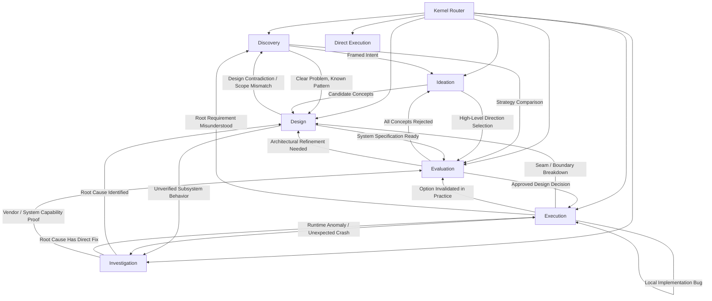

# Routing Matrix & Transition Graph

This reference governs how the Kernel (`nexload-reasoning`) maps raw prompts and tasks to specific cognitive specialists, resolves conflicts when multiple skills seem applicable, and navigates non-linear transitions.

---

## 1. Primary Specialist Routing Table

| Unresolved Need / Symptom | Primary Cognitive Question | Routed Specialist |
|---|---|---|
| Ambiguous intent, solution disguised as requirement, scope boundaries unclear | *"What problem are we actually solving, under what constraints, and what must remain unchanged?"* | `nexload-reasoning-discovery` |
| Crashes, inconsistent behavior, performance anomaly, conflicting documentation | *"What is actually true/happening, what is the root cause, and what discriminates hypotheses?"* | `nexload-reasoning-investigation` |
| Solution fixation, need for novel mechanisms, exploring alternative architectures | *"What materially different mechanisms could achieve this objective?"* | `nexload-reasoning-ideation` |
| Selected direction needs interfaces, state ownership, seams, or failure behavior | *"How can this direction work as an internally coherent, minimal, and bounded system?"* | `nexload-reasoning-design` |
| Multiple viable designs, library selection, risk assessment, pre-mortem, trade-offs | *"Which direction should we select based on material trade-offs, risk, and reversibility?"* | `nexload-reasoning-evaluation` |
| Approved design ready to implement, migration planning, verification, recovery | *"What is the safest sequence to implement this, how do we prove it works, and how do we recover?"* | `nexload-reasoning-execution` |
| Deterministic refactor, mechanical syntax change, factual query, approved plan step | *No cognitive decomposition required.* | `NONE` (Direct execution) |

---

## 2. Non-Linear Transition Graph

The reasoning ecosystem is a **directed graph**, never a rigid waterfall pipeline. Real problems transition between specialists dynamically based on emerging evidence:

---

## 3. Conflict Resolution Heuristics

When a task exhibits signals for multiple specialists, use these disambiguation rules:

### A. Discovery vs. Investigation ("Why is this failing?")
- **Discovery:** The failure stems from mismatched expectations, vague business requirements, or unclear stakeholder goals ("Users aren't adopting feature X").
- **Investigation:** The failure stems from an observed deviation between expected system behavior and actual runtime/data facts ("Requests return 500 intermittently").

### B. Ideation vs. Design ("We need architecture options")
- **Ideation:** Generates $\ge 3$ mechanism-distinct concepts (e.g., Pull vs. Push vs. Event-driven; Client vs. Worker). Focuses on conceptual variety without deep interface contracts.
- **Design:** Synthesizes a candidate direction into state ownership, module boundaries, data flow, error paths, and concrete contracts.

### C. Design vs. Evaluation ("Should we build X or Y?")
- **Design:** Asks *"How could option X work as a coherent system?"*
- **Evaluation:** Asks *"Given that both X and Y could work, which one should we choose based on constraints, cost, complexity, and reversibility?"*

### D. Evaluation vs. Execution ("Let's deploy this change")
- **Evaluation:** Decides whether to proceed, evaluating timing, risks, blast radius, and rollbacks.
- **Execution:** Sequences atomic tasks, writes code/config, gathers verification evidence, and handles execution recovery.

---

## 4. The `NONE` Routing Rule

If the prompt can be satisfied by a direct tool call or straightforward code edit where:
1. No architectural boundary is altered,
2. No business logic ambiguity exists,
3. The change is completely reversible, and
4. Verification is instantaneous and deterministic,

**The Kernel routes to `NONE`.** Do not add specialist overhead to trivial work.
