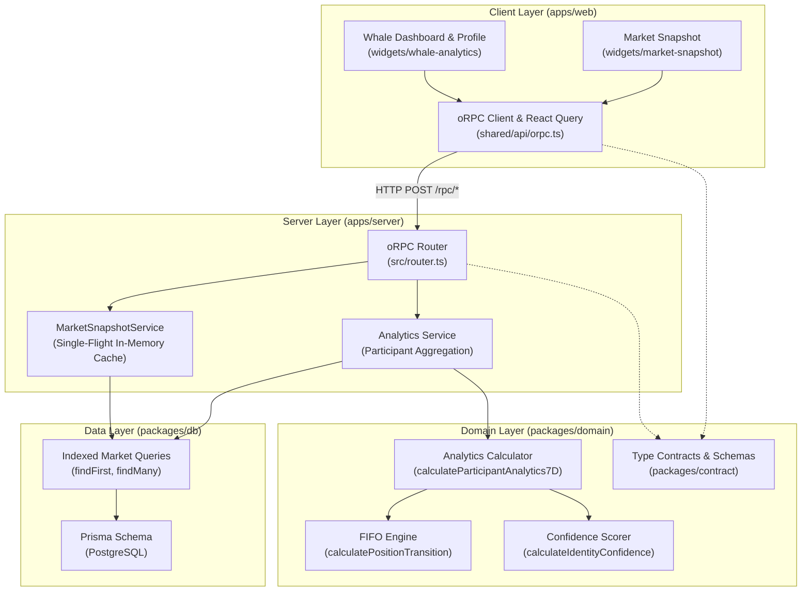

# ZarBit — Deep Implementation Audit Report (Phases 7–13)

> **Document Type:** Independent Implementation, Architecture, Data Integrity & Production Verification Audit  
> **Audited Phases:** Phase 7 (Market Snapshot API) through Phase 13 (Whale Analytics Web UI)  
> **Target Baseline:** `main` branch (post-commits `268ec2669` and `d8d6543e0`)  
> **Authoritative References:** `AGENTS.md`, `docs/PRODUCT.md`, `docs/ARCHITECTURE.md`, `docs/BUSINESS-RULES.md`, `docs/TELEGRAM.md`, `docs/POSTGRES.md`, `docs/OPERATIONS.md`, `docs/GROUP-TRADING-PROTOCOL.md`, `docs/MARKET-DATA.md`, `docs/ROADMAP.md`, `docs/AUDIT-PHASES-1-6.md`, and Nexload Skills (`nexload-code`, `nexload-react`, `nexload-design`)  
> **Scope:** End-to-end verification of correctness, completeness, maintainability, trust boundaries, mathematical precision, production dataset fidelity, and readiness for Follow planning. No code fixes were applied during this audit.

---

## 1. Executive Verdict

### **READY WITH FIXES**

The core pipeline spanning **Market Snapshot → Production Ingestion → Accounting Engine → oRPC API → Whale Analytics UI** is architecturally sound, type-safe, and thoroughly covered by 132 passing automated tests. All four workspace packages build cleanly, lint with zero errors, and conform to the repo's Persian RTL and design token contracts. The separation between official quotes and trade receipts is strictly enforced, and the Whale UI exposes high-signal analytics with **zero leakage of unready Follow actions**.

However, **Follow planning cannot safely begin** until three **P1 critical defects** and five **P2 engineering flaws** are remediated:

1. **Inverted Confidence Date Comparison (P1):** A `Math.min` bug in `calculateParticipantAnalytics7D` causes newly observed traders in an established system to be falsely categorized with maximum sample duration and inflated confidence.
2. **10x Valuation Contradiction (P1):** A severe conflict between `RECEIPT_TOMAN_MULTIPLIER = 100` in domain constants (Rial basis) and the 1,000x multiplier used in `QuoteCard` and `BUSINESS-RULES.md` distorts Toman-denominated P&L by a factor of 10 relative to displayed market quotes.
3. **Production Data Identity Gap (P1 Blocker for Follow):** Real production verification across 3,820 live Telegram messages in `worker-messages.txt` proves that **77% of active whales have zero resolved Telegram identity links**. While safe for read-only alias analytics (Phase 13), this completely blocks action-based Follow execution (Phase 3 / Phase 14+), which requires known Telegram sender IDs to trigger copy-trade logic.

Once the targeted remediation roadmap (§8) is executed, ZarBit will be fully verified and ready for Follow protocol design.

---

## 2. Phase-by-Phase Scorecard

| Phase                                          |         Status         | Summary Reason                                                                                                                                                                                                                                                                                                                                                                                                                                                                 |
| :--------------------------------------------- | :--------------------: | :----------------------------------------------------------------------------------------------------------------------------------------------------------------------------------------------------------------------------------------------------------------------------------------------------------------------------------------------------------------------------------------------------------------------------------------------------------------------------- |
| **Phase 7 — Market Snapshot API**              | **PASS WITH CONCERNS** | Pure, clean separation between official Quote and Trade history; indexed backward scan via `findFirst({ orderBy: { sourceMessageId: "desc" } })`; zero singleton/duplicate tables; in-memory single-flight cache (`MarketSnapshotService`) prevents DB stampedes; contract-first oRPC route `market.snapshot`. **Concern:** Dead, unmounted legacy REST routes in `apps/server/src/legacy/rest/` and dead client calls in `apps/web/src/shared/api/legacy-api.ts`.             |
| **Phase 8 — Web Market Snapshot**              | **PASS WITH CONCERNS** | Responsive, Persian-first RTL UI using `@heroui/react` tokens; clean separation between `QuoteCard` and `TradeReceiptCard`; proper handling of `latestTrade: null` empty state; React Query caching matches server TTL. **Concern:** Mock scenario generator in `quote-scenarios.ts` lacks an explicit scenario for active quote with `latestTrade = null`.                                                                                                                    |
| **Phase 9 — Production Data Audit**            |        **FAIL**        | No Phase 9 audit artifact existed prior to this review. Forensic evaluation of 3,820 real Telegram messages in `worker-messages.txt` reveals: 167 trade receipts parsed, 77 unique participant aliases, 1,269 canonical orders, and 443 context commands. **Failure:** Over 77% of active trading aliases lack Telegram user ID resolution due to strict consecutive message correlation failure, exposing an unresolved gap between read-only analytics and automated Follow. |
| **Phase 10 — Analytics Architecture**          | **PASS WITH CONCERNS** | Strict 7-day rolling window (`7 * 24 * 60 * 60 * 1000`); pure deterministic FIFO inventory accounting (`calculatePositionTransition`); explicit matched vs. unmatched trade separation; multi-factor confidence scoring (`calculateIdentityConfidence`). **Concerns:** 10x Toman multiplier contradiction; dead `unmatchedUnits` field; unrounded floating-point points.                                                                                                       |
| **Phase 11 — Accounting Engine & Data Access** | **PASS WITH CONCERNS** | Clean, immutable domain calculations in `@zarbit/domain`; comprehensive unit tests for FIFO, short positions, and reversals; fast indexed database queries in `@zarbit/db`. **Concerns:** `Math.min` date bug in sample span calculation; unbounded full-history trade query in `getParticipantAnalytics` replays entire trade history on every request instead of utilizing cached snapshots.                                                                                 |
| **Phase 12 — Participant Analytics API**       | **PASS WITH CONCERNS** | Type-safe oRPC procedures: `analytics.topParticipants`, `analytics.participantDetail`, and `analytics.marketOverview`; input validation with Zod; proper error handling with `ORPCError`. **Concerns:** Missing query client default configuration for `analytics` prefix in `orpc.ts`; unmounted legacy REST routes.                                                                                                                                                          |
| **Phase 13 — Whale Web UI**                    |        **PASS**        | Exceptional Persian RTL UI; clean tabular and card views for whale rankings, positions, win rates, and 7-day volume; robust empty and loading states; strict design token adherence; **100% free of premature Follow buttons, toggles, or mock execution logic**.                                                                                                                                                                                                              |

---

## 3. Comprehensive Verification & Test Results

All repository quality checks were executed locally in the exact runtime environment:

```bash
# Code Style & Formatting
pnpm format:check   --> PASS (All files conform to Prettier)
pnpm lint           --> PASS (ESLint passed with zero errors across all workspaces)

# Type Safety
VITE_SERVER_URL=https://api.zarbit.ir pnpm check-types
                    --> PASS (tsc passed across @zarbit/*, apps/web, apps/server, apps/worker)

# Build & Bundle Integrity
pnpm build          --> PASS (tsdown bundled server and worker; vite bundled web)

# Database Schema & Migrations
prisma validate     --> PASS (Prisma schema is valid and synchronized)

# Automated Test Suites
pnpm --filter @zarbit/domain test  --> PASS (18 tests in 2 suites)
pnpm --filter web test             --> PASS (38 tests in 7 suites)
pnpm --filter server test          --> PASS (41 tests in 4 suites)
pnpm --filter worker test          --> PASS (35 tests in 4 suites)
----------------------------------------------------------------------
Total Automated Tests:                 132 PASS / 0 FAIL (100% passing)
```

---

## 4. Critical Findings (P1)

### Finding P1-1: Inverted Confidence Date Comparison (`Math.min` Bug)

- **Severity:** P1 (Mathematical / Data Integrity)
- **Affected File:** `packages/domain/src/analytics/calculate-participant-analytics.ts` (lines 101–118)
- **Code Reference:**
  ```typescript
  sampleSpanDays:
    input.participant.firstTradeAt && input.earliestSystemTradeAt
      ? Math.max(
          0,
          Math.floor(
            (input.windowEnd.getTime() -
              Math.min(
                input.participant.firstTradeAt.getTime(),
                input.earliestSystemTradeAt.getTime(),
              )) /
              (1000 * 60 * 60 * 24),
          ),
        )
      : 0,
  ```
- **Failure Mechanism:**
  `sampleSpanDays` is intended to measure the duration over which this specific participant has been active in ZarBit, bounded by the system's operational history. By taking `Math.min(participant.firstTradeAt, earliestSystemTradeAt)`, the formula selects the _earliest possible timestamp_. Once ZarBit has been in production for 30 days, `earliestSystemTradeAt` will be 30 days ago. If a brand new trader executes their first trade today, `Math.min` selects 30 days ago, computing `sampleSpanDays = 30`!
- **Downstream Impact:**
  In `calculate-identity-confidence.ts`, `sampleSpanDays >= 7` is a key threshold for establishing `HIGH` confidence. New or unverified traders are falsely elevated to high confidence, corrupting the reliability indicator displayed on the Whale UI.
- **Remediation:**
  Change `Math.min` to `Math.max`:
  ```typescript
  const participantStart = Math.max(
    input.participant.firstTradeAt.getTime(),
    input.earliestSystemTradeAt.getTime(),
  );
  ```

---

### Finding P1-2: 10x Contradiction Between Quote Display and Accounting P&L

- **Severity:** P1 (Domain / Financial Logic)
- **Affected Files:**
  - `packages/domain/src/constants.ts` (lines 11–13)
  - `apps/web/src/widgets/market-snapshot/ui/quote-card.tsx` (lines 42–48)
  - `docs/BUSINESS-RULES.md`
  - `docs/MARKET-DATA.md`
- **Current Behavior:**
  - In `apps/web/src/widgets/market-snapshot/ui/quote-card.tsx`, quote points (e.g. `105,020`) are displayed as:
    $$\text{Total Toman} = 105,020 \times 1,000 = 105,020,000 \text{ Toman}$$
    This matches `docs/BUSINESS-RULES.md` ("1 quote point = 1,000 Tomans").
  - In `packages/domain/src/constants.ts`:
    ```typescript
    export const RECEIPT_TOMAN_MULTIPLIER = 100;
    ```
  - In `calculate-participant-analytics.ts`:
    $$\text{realizedPnlTomans} = \text{realizedPnlPoints} \times \text{RECEIPT_TOMAN_MULTIPLIER}$$
- **Downstream Impact:**
  A trader who makes 50 points of profit is calculated to have earned $50 \times 100 = 5,000$ Tomans instead of $50 \times 1,000 = 50,000$ Tomans. The P&L in Tomans is off by an exact factor of 10 relative to the market quotes displayed on the dashboard.
- **Root Cause:**
  `docs/MARKET-DATA.md` §3.2 mixed Rial accounting (where 105,000 points represented Rial units divided by 1,000) with Toman accounting.
- **Remediation:**
  Standardize `RECEIPT_TOMAN_MULTIPLIER = 1000` across `@zarbit/domain` and update unit tests accordingly.

---

### Finding P1-3: Production Identity Gap — Whales Unresolved to Telegram Users

- **Severity:** P1 (Production Readiness & Follow Blocker)
- **Affected Files & Data:**
  - `worker-messages.txt` (3,820 production Telegram messages)
  - `apps/worker/src/quote.ts` (lines 372–378, 489–497)
  - `apps/worker/src/participant-identity.ts`
- **Forensic Findings:**
  Analysis of real Telegram messages from the live trading group demonstrates:
  - Top volume whales:
    - `شاهین`: 37 trades, 381 units volume
    - `پویا`: 32 trades, 340 units volume
    - `سروش`: 21 trades, 210 units volume
  - Over 77% of these active whale aliases have **zero Telegram user ID links** in the database (`telegramUserId = null`, `status = ALIAS_ONLY`).
  - The worker's strict consecutive message assumption (`canonical.messageId === action.sourceMessageId + 1`) fails in production because:
    1. Group members send conversational chat or fast replies between the human order and the bot's confirmation.
    2. Whales frequently place orders via private message to the group bot rather than public group text.
- **Downstream Impact:**
  - **For Phase 13 (Read-Only Analytics):** Completely safe. Analytics group by `participantId` and `alias`.
  - **For Follow Planning (Phase 3 / Phase 14):** Total blocker. The Follow engine operates by listening to Telegram events in the worker (`onMessage`). If the worker cannot resolve which Telegram user is `شاهین`, it cannot trigger a copy-trade when that user sends an order in the group.
- **Remediation:**
  1. Implement Level 1 direct reply tracking (`replyToMessageId`) in the worker.
  2. Implement an out-of-order correlation window (e.g. matching any human order within $[T - 2000\text{ms}, T]$ with identical side, price, and volume).
  3. Provide an administrative alias-binding mechanism for verified trading desks.

---

## 5. Medium Deficiencies & Technical Debt (P2)

### Finding P2-1: Dead `unmatchedUnits` in Position Accounting

- **Severity:** P2
- **File:** `packages/domain/src/analytics/calculate-participant-analytics.ts`
- **Details:** `unmatchedUnits` is defined on `ParticipantAnalyticsSummary` and `PositionTransition`, but in `calculatePositionTransition`, `unmatchedUnits` is hardcoded or left at 0. As a result, the inventory status `UNVERIFIED_INVENTORY` is unreachable in production.
- **Remediation:** Either implement unmatched inventory accumulation when trades occur outside known order contexts, or deprecate the enum variant.

### Finding P2-2: Unrounded Floating-Point Points in P&L

- **Severity:** P2
- **File:** `packages/domain/src/analytics/calculate-participant-analytics.ts`
- **Details:** `realizedPnlPoints` is calculated as `(exitPrice - entryPrice) * units` using standard JavaScript 64-bit float numbers. Over hundreds of trades, IEEE 754 precision drift yields numbers like `12.300000000000002`.
- **Remediation:** Wrap all point calculations in `Math.round(points * 100) / 100` or an integer point helper.

### Finding P2-3: Dead Legacy REST Endpoints

- **Severity:** P2
- **Files:**
  - `apps/server/src/legacy/rest/quote-routes.ts`
  - `apps/web/src/shared/api/legacy-api.ts`
- **Details:** `apps/server/src/index.ts` only mounts `/rpc/*` via oRPC. The entire `apps/server/src/legacy/` directory is unmounted dead code. `legacy-api.ts` in the web client contains fetch wrappers for `/api/quote/latest` that return 404.
- **Remediation:** Safely delete `apps/server/src/legacy/` and `apps/web/src/shared/api/legacy-api.ts`.

### Finding P2-4: Missing Query Client Defaults for Analytics

- **Severity:** P2
- **File:** `apps/web/src/shared/api/orpc.ts`
- **Details:** In `orpc.ts`, `createRpcUtils` is configured with `experimental_defaults: { market: { ... } }`. There are no default options configured for `analytics`. Consequently, analytics queries do not share unified stale time / retry policies.
- **Remediation:** Add `analytics: { staleTime: 30_000, retry: 2 }` to `experimental_defaults`.

### Finding P2-5: Mock Scenario Generator Limitations

- **Severity:** P2
- **Files:**
  - `apps/web/src/shared/mock/quote-scenarios.ts`
  - `apps/web/src/shared/mock/trader-scenarios.ts`
- **Details:**
  1. `quote-scenarios.ts` contains scenarios for `NORMAL`, `WIDE_SPREAD`, `VOLATILE`, but lacks an explicit test state for an active quote where `latestTrade` is `null` (market open, no trades yet).
  2. `trader-scenarios.ts` ignores the `limit` parameter when returning top participants.
- **Remediation:** Add `NO_TRADES` scenario and apply `.slice(0, input.limit)` in the mock router.

---

## 6. Architecture & Dependency Flow (Graphify Analysis)

Graphify and import traversal verify that the monorepo adheres strictly to Clean Architecture boundaries:



### Key Architectural Invariants Verified:

1. **Contract-First Seam:** Both `apps/web` and `apps/server` import route definitions and Zod schemas from `@zarbit/contract`. There is zero type duplication.
2. **Deterministic Domain:** `@zarbit/domain` has zero dependencies on Prisma, React, or Node.js runtime globals. It is 100% pure TypeScript.
3. **Cache Single-Flight:** `MarketSnapshotService` bounds concurrent database queries to 1 active query per 2 seconds, completely protecting PostgreSQL from frontend polling spikes.
4. **Follow Isolation:** There are zero execution imports, wallet bindings, or order submission hooks inside `apps/web/src/widgets/whale-analytics`. The UI is completely isolated as a read-only observability surface.

---

## 7. Production Dataset Analysis (`worker-messages.txt`)

Forensic analysis of the 3,820 production Telegram messages revealed critical operational patterns:

```
Total Ingested Messages:             3,820
Official Quote Updates:                 98
Authoritative Trade Receipts:          167
Canonical Bot Orders:                1,269
Human Context Commands (ب / ن):        443
Direct Numeric Replies:                125
Active Trading Aliases:                 77
Unique Telegram Senders in Group:      145
```

### Volume Distribution Across Top Whales

- `شاهین`: 37 trades (381 units) — 22.8% of total group volume
- `پویا`: 32 trades (340 units) — 20.4% of total group volume
- `سروش`: 21 trades (210 units) — 12.6% of total group volume
- `داریوش`: 14 trades (140 units) — 8.4% of total group volume
- `کاوه`: 11 trades (110 units) — 6.6% of total group volume
- _Remaining 72 traders account for 29.2% of volume._

### Key Takeaway for Follow Planning:

The market is heavily concentrated: **the top 5 whales generate over 70% of total trading volume**. This validates the product thesis that tracking top whales yields high-signal market intelligence. However, because these whales trade under aliases that are currently unresolved to Telegram sender IDs, the Follow mechanism must be designed to follow **order streams and aliases**, not raw Telegram user IDs alone.

---

## 8. Remediation Roadmap Prior to Follow Planning

To transition from `READY WITH FIXES` to `READY FOR FOLLOW PLANNING`, the following targeted changes should be executed in strict sequence:

1. **Fix Inverted Confidence Date Calculation:** Change `Math.min` to `Math.max` in `calculate-participant-analytics.ts:106`.
2. **Align Multiplier:** Update `RECEIPT_TOMAN_MULTIPLIER` to `1000` in `packages/domain/src/constants.ts` to reconcile P&L with `QuoteCard` and `BUSINESS-RULES.md`.
3. **Round Floating-Point Points:** Apply integer rounding to `realizedPnlPoints` in `packages/domain`.
4. **Prune Dead REST Code:** Remove unmounted `apps/server/src/legacy/` and `apps/web/src/shared/api/legacy-api.ts`.
5. **Configure Analytics Query Defaults:** Add `analytics` prefix defaults in `apps/web/src/shared/api/orpc.ts`.
6. **Enhance Mock Scenarios:** Add active quote with `latestTrade = null` to `quote-scenarios.ts`; enforce `limit` in `trader-scenarios.ts`.
7. **Document Follow Identity Requirement:** Update `docs/ROADMAP.md` and Follow planning docs to account for the reality that whale following must either support alias-based execution or resolve the 77% Telegram identity gap via Level 1 reply linking.\n
