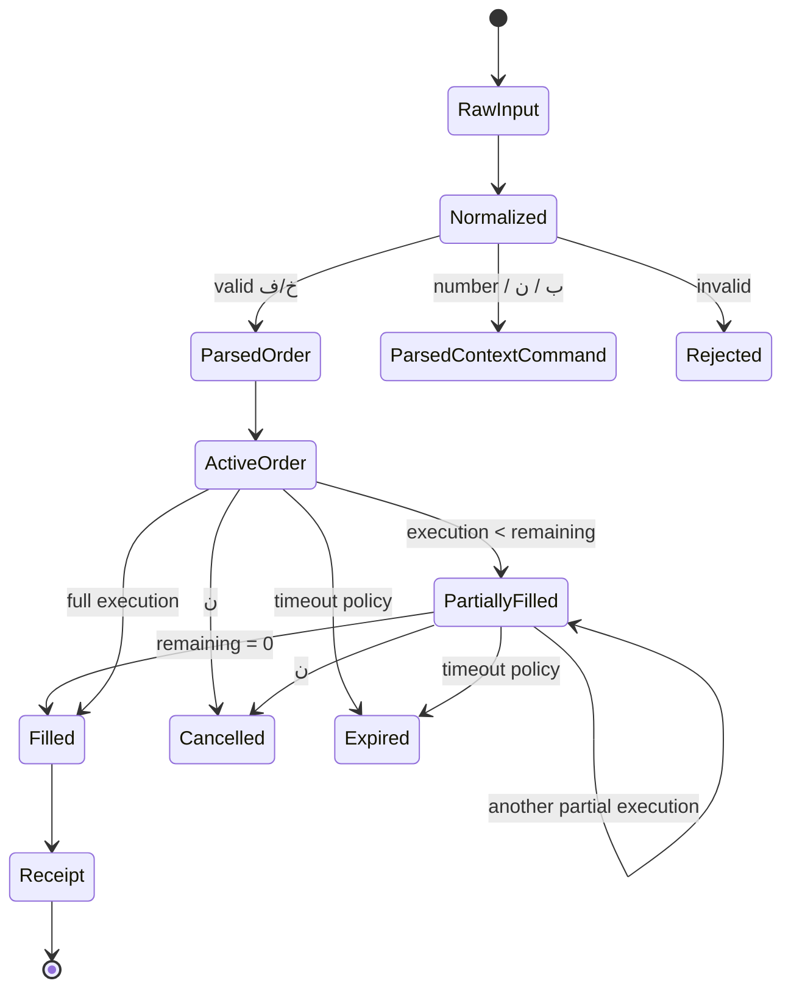

# ZarBit — Telegram Gold Trading Group Protocol

> **Document type:** LLM-ready protocol specification / reverse-engineered domain reference  
> **Primary source:** `worker-messages.txt` — 3,820 observed Telegram message events from 2026-09-10  
> **Scope:** ساختار کاری گروه، اصطلاحات، قالب پیام‌ها، چرخه لفظ/معامله، مظنه، مانده، حواله و قواعد parsing  
> **Status:** Reverse-engineered; قواعد به سه سطح `CONFIRMED`، `HIGH-CONFIDENCE` و `UNRESOLVED` تقسیم شده‌اند.  
> **Important:** این سند توصیف پروتکل مشاهده‌شده است؛ هر جا داده کافی نباشد، نباید inference به‌عنوان قانون قطعی پیاده‌سازی شود.

---

## 1. هدف سند

این سند زبان عملیاتی و پروتکل معاملاتی گروه تلگرام را به شکلی تعریف می‌کند که یک LLM یا توسعه‌دهنده بتواند بدون خواندن کل لاگ:

- انواع پیام‌ها را تشخیص دهد.
- اصطلاحات داخلی گروه را بفهمد.
- پیام‌های کوتاه خرید/فروش را parse کند.
- تفاوت «لفظ فعال» با «معامله انجام‌شده» را حفظ کند.
- مفهوم `مانده` و partial fill را بفهمد.
- نقش `ب`، `ن` و عدد مستقل را با context صحیح تشخیص دهد.
- قیمت کامل و قیمت shorthand را از هم تفکیک کند.
- state machine تقریبی گروه را بازسازی کند.
- از inference اشتباه در پیام‌های context-dependent جلوگیری کند.

این سند **spec رفتار گروه** است، نه مستند پیاده‌سازی فعلی ZarBit.

---

## 2. منبع و کیفیت شواهد

### 2.1 Dataset

فایل مشاهده‌شده:

```text
worker-messages.txt
Event: telegram.message.observed
Records: 3820
```

از کل dataset:

| معیار | مقدار |
|---|---:|
| کل eventها | 3,820 |
| eventهای گروه معاملاتی اصلی | 3,341 |
| خروجی‌های ربات اصلی در گروه | 1,534 |
| پیام canonical لفظ/سفارش ربات | 1,270 |
| حواله/رسید معامله ربات | 167 |
| اعلان مظنه ربات | 97 |

در پیام‌های غیرربات گروه، پس از normalize کردن فاصله و رقم‌ها:

| شکل پیام | تعداد مشاهده |
|---|---:|
| خرید/فروش قابل شناسایی (`...خ...` / `...ف...`) | 1,211 |
| `ن` | 377 |
| `ب` | 66 |
| عدد مستقل | 125 |
| سایر/خطا/متن آزاد | 28 |

> این آمار **frequency رفتار مشاهده‌شده** است، نه تضمین اینکه تک‌تک پیام‌ها توسط ربات معتبر شناخته شده‌اند؛ خصوصاً پیام‌های context-dependent بدون `replyToMessageId` قابل اثبات کامل نیستند.

### 2.2 محدودیت اصلی لاگ

لاگ فعلی `textPreview` را دارد اما metadata مربوط به Reply را ثبت نکرده است. بنابراین برای پیام‌هایی مانند:

```text
1
2
ب
ن
```

متن به‌تنهایی برای تعیین semantics کافی نیست.

برای reverse engineering کامل‌تر باید حداقل این داده‌ها capture شوند:

```ts
type ObservedTelegramMessage = {
  chatId: string;
  senderId: string;
  messageId: number;
  text: string;
  date: Date;

  replyToMessageId?: number;
  replyToPeerId?: string;

  editDate?: Date;
  groupedId?: string;
  deletedAt?: Date;
};
```

### 2.3 سطوح اطمینان

در این سند:

- **`CONFIRMED`**: مستقیماً با چند نمونه مستقل در لاگ قابل مشاهده است.
- **`HIGH-CONFIDENCE`**: توالی داده‌ها تقریباً تنها یک تفسیر منطقی دارد، اما metadata ناقص است.
- **`UNRESOLVED`**: شواهد کافی برای تبدیل به rule قطعی وجود ندارد.

---

# 3. مدل ذهنی کل سیستم

گروه را نباید مانند یک chat معمولی مدل کرد.

مدل دقیق‌تر:

```text
Telegram Group
    ↓
compact human commands ("لفظ")
    ↓
Bot Parser
    ↓
Canonical Order Book
    ↓
Reply / Match / Cancel
    ↓
Trade
    ↓
Authoritative Receipt ("حواله")
```

ربات اصلی حداقل چهار نقش منطقی دارد:

1. **Message Parser**
2. **Quote Resolver**
3. **Order/لفظ Registry**
4. **Trade/Settlement Publisher**

بر اساس رفتار مشاهده‌شده، سیستم از نظر مفهومی شبیه یک **order book فشرده روی Telegram messages** است.

---

# 4. اصطلاحات اصلی گروه

## 4.1 لفظ

**سطح اطمینان: `CONFIRMED`**

`لفظ` اصطلاح رایج گروه برای اعلام کوتاه خرید یا فروش است.

در خود dataset عبارت زیر نیز مشاهده شده:

```text
خراب نکن لفظو
```

یک لفظ معمولاً شامل:

```text
[تعداد] [سمت] [قیمت]
```

مثال:

```text
1خ950
۲ف۱۲۰
1 ف 105050
خ ۷۰۰
```

بعد از parse، ربات آن را به پیام canonical تبدیل می‌کند.

---

## 4.2 خرید — `خ`

**سطح اطمینان: `CONFIRMED`**

`خ` یعنی **خرید**.

Canonical representation ربات:

```text
🔵 <name> <quantity> خ <price> (مانده: <remaining>)
```

رنگ semantic:

```text
🔵 = BUY
```

مثال واقعی:

```text
User:
1خ104900

Bot:
🔵 رسول اُف 1 خ 104900 (مانده: 1)
```

---

## 4.3 فروش — `ف`

**سطح اطمینان: `CONFIRMED`**

`ف` یعنی **فروش**.

Canonical representation:

```text
🔴 <name> <quantity> ف <price> (مانده: <remaining>)
```

رنگ semantic:

```text
🔴 = SELL
```

مثال واقعی:

```text
User:
۲ف۱۲۰

Bot:
🔴 سناتور 2 ف 105120 (مانده: 2)
```

---

## 4.4 مظنه

**سطح اطمینان: `CONFIRMED`**

مظنه قیمت مرجع جاری گروه است.

Canonical output:

```text
.
🟡 مظنه: 105020 🟡
```

قیمت مظنه در پروتکل به‌صورت **compact integer** نگهداری/نمایش داده می‌شود:

```text
105020
104950
104900
```

نه به‌صورت:

```text
105,020,000
```

اعداد کوتاه معاملات بر اساس این context تفسیر می‌شوند.

---

## 4.5 مانده

**سطح اطمینان: `CONFIRMED`**

هر لفظ canonical دارای stateی به نام `مانده` است.

مثال:

```text
🔴 میرزایی 2 ف 105100 (مانده: 1)
```

تفسیر:

```ts
quantity = 2
remaining = 1
```

پس حداقل یک واحد از سفارش قبلاً مصرف/معامله شده و یک واحد هنوز active است.

قاعده مفهومی:

```text
remaining > 0  → order is still active/partially filled
remaining = 0  → no executable quantity remains
```

وجود `مانده` اثبات می‌کند که سیستم **partial fill** دارد.

---

## 4.6 حواله

**سطح اطمینان: `CONFIRMED`**

`حواله` پیام authoritative ربات برای **معامله انجام‌شده** است.

قالب واقعی:

```text
.
🔵 خریدار : <buyer>
🔴 فروشنده : <seller>
✅ تعداد: <quantity> قیمت: <price × 1000> ✅
⏱️ ساعت: <time> <jalali-date>
🔖 شماره حواله: <reference>
```

مثال:

```text
.
🔵 خریدار : مرداد
🔴 فروشنده : سناتور
✅ تعداد: 2 قیمت: 105٬120٬000 ✅
⏱️ ساعت: 15:18:50 1405/06/19
🔖 شماره حواله: 9368
```

**قاعده مهم:**

```text
Canonical لفظ ≠ Trade confirmation
Receipt/Havale = Trade confirmation
```

وجود پیام:

```text
🔴 X 1 ف 105100 (مانده: 1)
```

تنها نشان‌دهنده سفارش/لفظ active است.

برای `DONE` شدن معامله باید حواله مشاهده شود یا منبع authoritative دیگری صریحاً تأیید کند.

---

# 5. نقش‌ها و actorها

مدل actorها:

```ts
type Actor =
  | "TRADER"
  | "QUOTE_PUBLISHER"
  | "GROUP_TRADING_BOT";
```

## 5.1 Trader

کاربری که می‌تواند:

- لفظ خرید بدهد.
- لفظ فروش بدهد.
- لفظ دیگران را بردارد.
- مقدار مشخصی از لفظ را بردارد.
- لفظ خودش را لغو کند.

## 5.2 Quote Publisher

کاربر/کاربران مجازی که عدد مظنه را می‌فرستند.

نمونه:

```text
User:
۱۰۵۰۲۰

Bot:
🟡 مظنه: 105020 🟡
```

یا:

```text
User:
۹۳۰

Bot:
🟡 مظنه: 104930 🟡
```

از متن پیام به‌تنهایی نمی‌توان تشخیص داد که یک عدد مستقل `quote update` است یا `take quantity`.

**Sender permission + reply context تعیین‌کننده هستند.**

## 5.3 Group Trading Bot

ربات اصلی:

- raw commandهای معامله را consume می‌کند.
- پیام canonical منتشر می‌کند.
- order state را نمایش می‌دهد.
- حواله معامله صادر می‌کند.
- مظنه canonical منتشر می‌کند.

طبق premise عملیاتی گروه، raw messageهای کاربران توسط ربات حذف می‌شوند و پیام canonical ربات باقی می‌ماند.

> **شناسه شرکت‌کننده:** نامی که ربات در سفارش canonical (`🔵 <name> ...` / `🔴 <name> ...`) یا در حواله (`🔵 خریدار : <name>` / `🔴 فروشنده : <name>`) منتشر می‌کند، **Participant Alias رسمی و شناسه کانونی شرکت‌کننده** در پروتکل است.

---

# 6. کلاس‌های اصلی پیام

پروتکل حداقل این message classها را دارد:

```ts
type ProtocolMessage =
  | QuoteInput
  | QuoteAnnouncement
  | OrderInput
  | CanonicalOrder
  | TakePartialCommand
  | TakeAllCommand
  | CancelCommand
  | TradeReceipt
  | UnknownMessage;
```

---

# 7. Normalization قبل از Parsing

Parser نباید مستقیماً regex را روی raw text اجرا کند.

## 7.1 Digit normalization

هر سه خانواده رقم در dataset مشاهده شده‌اند:

```text
ASCII:
0123456789

Persian:
۰۱۲۳۴۵۶۷۸۹

Arabic-Indic:
٠١٢٣٤٥٦٧٨٩
```

همه باید به ASCII normalize شوند.

مثال واقعی:

```text
١ ف ١٠٥٠٥٠
```

به:

```text
1ف105050
```

normalize می‌شود و ربات canonical زیر را ساخته:

```text
🔴 ساشا 1 ف 105050 (مانده: 1)
```

## 7.2 Whitespace normalization

نمونه‌های معادل:

```text
1خ104900
1 خ104900
1خ 104900
1 خ 104900
۱ خ ۱۰۴۹۰۰
```

Parser باید فاصله‌های میان tokenها را تحمل کند.

پیشنهاد normalization:

```ts
normalized = input
  .normalize("NFKC")
  .translatePersianAndArabicDigitsToAscii()
  .removeBidiMarks()
  .trim()
  .replace(/\s+/g, "");
```

## 7.3 Character normalization

حداقل باید این موارد در نظر گرفته شوند:

```text
ZWNJ
RLM
LRM
NBSP
Arabic/Persian digits
```

اما نباید حروف ناشناخته یا typoها را بیش از حد اصلاح کرد؛ parser مالی باید **محافظه‌کار** باشد.

---

# 8. Grammar سطح اول

نسخه مفهومی:

```ebnf
DIGIT         = "0" | "1" | ... | "9" ;
SIDE          = "خ" | "ف" ;

QUANTITY      = DIGIT , { DIGIT } ;
PRICE         = DIGIT , { DIGIT } ;

ORDER         = [ QUANTITY ] , SIDE , PRICE ;

TAKE_PARTIAL  = QUANTITY ;
TAKE_ALL      = "ب" ;
CANCEL        = "ن" ;

QUOTE_INPUT   = PRICE ;
```

اما grammar به‌تنهایی کافی نیست.

این دو پیام:

```text
2
950
```

ممکن است با توجه به context معانی کاملاً متفاوتی داشته باشند.

پس parser واقعی باید:

```text
text + sender + reply target + current quote + active order state
```

را دریافت کند.

---

# 9. لفظ خرید/فروش

## 9.1 قالب canonical

```text
[quantity?][خ|ف][price]
```

نمونه‌های مشاهده‌شده:

```text
۱ف۰۵۰
1ف105000
1خ104850
۱خ۹۰۰
2 خ 800
خ ۷۰۰
ف ۹۹۰
```

## 9.2 quantity اختیاری

**سطح اطمینان: `CONFIRMED`**

در dataset حداقل 41 ورودی order-like بدون quantity صریح وجود دارد.

مثال واقعی:

```text
User:
خ ۷۰۰

Bot:
🔵 اسپاتیرا 1 خ 104700 (مانده: 1)
```

پس:

```ts
if quantity is omitted:
  quantity = 1
```

مثال فروش:

```text
User:
ف ۹۹۰

Bot:
🔴 اسپاتیرا 1 ف 104990 (مانده: 1)
```

---

# 10. Price Model

## 10.1 Compact price

قیمت داخلی لفظ‌ها و مظنه‌ها یک compact integer است.

مثلاً:

```text
104950
105020
105120
```

رسید همان مقدار را ×1000 نمایش می‌دهد.

```text
compact: 105120
receipt: 105٬120٬000
```

قاعده مشاهده‌شده:

```ts
receiptDisplayPrice = compactPrice * 1000;
```

---

## 10.2 Full compact price

**سطح اطمینان: `CONFIRMED`**

ورودی شش‌رقمی مستقیم پذیرفته می‌شود:

```text
1ف105050
```

→

```text
🔴 ... 1 ف 105050 (مانده: 1)
```

---

## 10.3 Three-digit shorthand

**سطح اطمینان: `CONFIRMED` برای وجود قابلیت؛ `HIGH-CONFIDENCE` برای الگوریتم دقیق resolve**

کاربر می‌تواند به‌جای قیمت کامل suffix بدهد.

مثال:

```text
Current quote:
104950

User:
1خ950

Bot:
🔵 ... 1 خ 104950 (مانده: 1)
```

مثال عبور از مرز هزارگان:

```text
Current region:
104xxx

User:
۱ف۰۵۰

Bot:
🔴 ... 1 ف 105050 (مانده: 1)
```

بنابراین `050` صرفاً عدد `50` نیست؛ resolver آن را در context مظنه به compact price مناسب تبدیل می‌کند.

### مدل استنباطی resolver

مدل محتمل برای suffix سه‌رقمی:

```ts
function resolveThreeDigitPrice(
  currentQuote: number,
  suffix: number,
): number {
  const base = Math.floor(currentQuote / 1000) * 1000;

  const candidates = [
    base - 1000 + suffix,
    base + suffix,
    base + 1000 + suffix,
  ];

  return nearestToCurrentQuote(candidates);
}
```

**این الگوریتم به‌عنوان implementation contract قطعی در نظر گرفته نشود** تا زمانی که dataset همراه reply/context و test caseهای مرزی جمع‌آوری شود.

---

## 10.4 One-/two-digit shorthand

**سطح اطمینان: `CONFIRMED` برای وجود**

نمونه واقعی:

```text
User:
1خ50

Bot:
🔵 رسول اُف 1 خ 105050 (مانده: 1)
```

نمونه دیگر:

```text
User:
۱ خ ۰۷

Bot:
🔵 آریشا 1 خ 105107 (مانده: 1)
```

و نمونه:

```text
User:
۵ف۱

Bot:
🔴 اصفهان 5 ف 104901 (مانده: 5)
```

یعنی parser حتی suffix بسیار کوتاه را نیز در context قیمت فعلی resolve می‌کند.

مدل محتمل:

```text
current price band + entered suffix
```

اما **مرز دقیق band** و tie-breaking باید جداگانه test شود.

---

## 10.5 Full monetary value with trailing zeros

**سطح اطمینان: `OBSERVED ONCE / NOT NORMATIVE`**

یک نمونه جالب:

```text
User:
1 خ 105105000

Bot:
🔵 افسانه 1 خ 105105 (مانده: 1)
```

این رفتار با تقسیم مقدار ورودی بر `1000` سازگار است.

ولی چون نمونه کافی نیست:

```text
DO NOT make 9-digit monetary input part of the required protocol
without further verification.
```

می‌توان آن را فقط به‌عنوان compatibility behavior احتمالی ثبت کرد.

---

# 11. مظنه Protocol

## 11.1 Quote announcement

قالب canonical:

```text
.
🟡 مظنه: <compactQuote> 🟡
```

مثال:

```text
.
🟡 مظنه: 104950 🟡
```

## 11.2 Full quote input

مثال واقعی:

```text
User:
۱۰۵۰۲۰

Bot:
.
🟡 مظنه: 105020 🟡
```

## 11.3 Shorthand quote input

مثال واقعی:

```text
User:
۹۳۰

Bot:
.
🟡 مظنه: 104930 🟡
```

سپس:

```text
User:
۹۵۰

Bot:
.
🟡 مظنه: 104950 🟡
```

پس quote publisher نیز می‌تواند suffix بفرستد.

## 11.4 عدد مستقل ambiguous است

این rule حیاتی است:

```text
NUMBER_ONLY is not self-describing.
```

عدد مستقل می‌تواند:

1. update مظنه باشد.
2. مقدار برداشتن یک لفظ باشد.
3. متن نامعتبر باشد.

پس:

```ts
parseNumberOnly({
  sender,
  replyToMessageId,
  permissions,
  activeOrders,
  quoteState,
});
```

باید context-aware باشد.

---

# 12. Canonical Order / لفظ Message

قالب:

```text
🔵 <name> <qty> خ <price> (مانده: <remaining>)
```

یا:

```text
🔴 <name> <qty> ف <price> (مانده: <remaining>)
```

مثال خرید:

```text
🔵 سولما 2 خ 104950 (مانده: 2)
```

مثال فروش:

```text
🔴 شهاب و مرضی 2 ف 105050 (مانده: 2)
```

مدل داده پیشنهادی برای فهم protocol:

```ts
type TradingSide = "BUY" | "SELL";

type CanonicalOrder = {
  owner: TraderIdentity;
  side: TradingSide;

  quantity: number;
  remaining: number;

  compactPrice: number;

  botMessageId: number;

  state:
    | "ACTIVE"
    | "PARTIALLY_FILLED"
    | "FILLED"
    | "CANCELLED"
    | "EXPIRED";
};
```

توجه: enum بالا **مدل مفهومی** است؛ نام دقیق stateهای ربات اصلی از لاگ معلوم نیست.

---

# 13. برداشتن بخشی از لفظ

## 13.1 Numeric reply

**سطح اطمینان: `HIGH-CONFIDENCE`**

عدد مستقل در context یک لفظ opposite-side به معنی مقدار موردنظر برای معامله است.

مثال واقعی:

```text
Existing sell:
🔴 میرزایی ... ف 104980

User:
۲

Bot receipt:
🔵 خریدار : عرفاان
🔴 فروشنده : میرزایی
✅ تعداد: 2 قیمت: 104٬980٬000 ✅
```

تفسیر:

```ts
takeQuantity = 2;
```

## 13.2 Precondition

این دستور نباید بدون context اجرا شود.

حداقل:

```ts
replyToMessageId != null
```

و reply target باید یک canonical active order معتبر باشد.

### Rule

```text
BUYER replies to SELL لفظ
SELLER replies to BUY لفظ
```

این rule از مدل معامله نتیجه می‌شود؛ برای enforce دقیق باید reply metadata ثبت شود.

---

# 14. `ب` — برداشتن کل مانده

**سطح اطمینان: `CONFIRMED`**

نمونه بسیار قوی:

```text
Bot:
🔴 سناتور 2 ف 105120 (مانده: 2)

User:
ب

Bot:
.
🔵 خریدار : مرداد
🔴 فروشنده : سناتور
✅ تعداد: 2 قیمت: 105٬120٬000 ✅
⏱️ ساعت: 15:18:50 1405/06/19
🔖 شماره حواله: 9368
```

پس:

```ts
if command === "ب":
  executionQuantity = targetOrder.remaining;
```

معنای semantic بهتر:

```text
ب = TAKE_ALL_REMAINING
```

نه صرفاً:

```text
BUY
```

زیرا خرید در grammar اصلی با `خ` بیان می‌شود.

---

# 15. `ن` — لغو

**سطح اطمینان: `HIGH-CONFIDENCE`**

`ن` در dataset بسیار پرتکرار است: 377 بار در گروه اصلی.

الگوی رایج:

```text
User:
۱ خ ۰۷

Bot:
🔵 آریشا 1 خ 105107 (مانده: 1)

Same user shortly after:
ن
```

تفسیر پروتکلی:

```text
ن = CANCEL
```

اما چون لاگ deletion/reply metadata ندارد، این دو حالت هنوز باید از هم تفکیک شوند:

```text
ن به‌صورت Reply روی لفظ خود
ن بدون Reply برای لغو لفظ فعال/آخر
```

اینکه ربات دقیقاً کدام لفظ را در حالت بدون Reply لغو می‌کند از dataset فعلی قابل اثبات کامل نیست.

بنابراین:

```ts
CANCEL_TARGET_RESOLUTION = UNRESOLVED
```

و نباید بدون evidence بیشتر clone شود.

---

# 16. Partial Fill و Remaining

**سطح اطمینان: `CONFIRMED`**

نمونه:

```text
🔴 میرزایی 2 ف 105100 (مانده: 1)
```

سپس حواله‌های یک‌واحدی برای همان فروشنده مشاهده می‌شود:

```text
🔵 خریدار : پاریس لند
🔴 فروشنده : میرزایی
✅ تعداد: 1 قیمت: 105٬100٬000 ✅
```

و:

```text
🔵 خریدار : فلفل
🔴 فروشنده : میرزایی
✅ تعداد: 1 قیمت: 105٬100٬000 ✅
```

مفهوم domain:

```ts
remainingAfterFill = remainingBeforeFill - executedQuantity;
```

مثال:

```text
quantity = 2
first execution = 1
remaining = 1

second execution = 1
remaining = 0
```

Order book باید quantity اصلی را از remaining جدا نگه دارد.

---

# 17. حواله و Settlement

## 17.1 Receipt schema

ساختار معنایی:

```ts
type TradeReceipt = {
  buyer: TraderIdentity;
  seller: TraderIdentity;

  quantity: number;

  compactPrice: number;
  displayedPrice: number;

  executedAt: Date;
  referenceNumber: string;
};
```

Relation:

```ts
displayedPrice = compactPrice * 1000;
```

## 17.2 Reference number

هر receipt دارای:

```text
🔖 شماره حواله: <number>
```

است.

این مقدار باید در ingestion به‌عنوان metadata مهم transaction نگهداری و index شود.

**توجه مهم:** بر اساس شواهد قطعی در dataset (به‌عنوان نمونه حواله `6380` در رویداد [2] و مجدداً در رویداد [2167] در یک روز تکرار شده است)، **شماره حواله globally unique نیست**. بنابراین:

```text
sourceMessageId = primary / unique identifier of the trade receipt
referenceNumber = indexed business metadata, NOT a unique constraint
```


## 17.3 DONE condition

برای clone یا automation:

```text
MESSAGE_SENT
```

نباید مساوی باشد با:

```text
TRADE_DONE
```

مدل امن:

```text
REQUESTED
→ SENT
→ AWAITING_CONFIRMATION
→ CONFIRMED_BY_RECEIPT
```

اگر ارسال انجام شده ولی receipt دیده نشده:

```text
UNKNOWN / AWAITING_CONFIRMATION
```

از retry کورکورانه باید جلوگیری شود؛ چون ممکن است معامله انجام شده باشد اما confirmation هنوز ingest نشده باشد.

---

# 18. چرخه کامل یک لفظ



`Expired` از نظر مفهومی محتمل است، ولی زمان و policy دقیق expiry در dataset فعلی اثبات نشده است.

---

# 19. Sequence Example A — ایجاد لفظ فروش

### Raw input

```text
۲ف۱۲۰
```

### Canonical bot output

```text
🔴 سناتور 2 ف 105120 (مانده: 2)
```

### Interpretation

```json
{
  "side": "SELL",
  "quantity": 2,
  "remaining": 2,
  "compactPrice": 105120
}
```

نکات:

- رقم فارسی پذیرفته شده.
- shorthand `120` به قیمت کامل resolve شده.
- `ف` فروش است.
- رنگ canonical قرمز است.

---

# 20. Sequence Example B — Take All

### Existing لفظ

```text
🔴 سناتور 2 ف 105120 (مانده: 2)
```

### User command

```text
ب
```

### Result

```text
.
🔵 خریدار : مرداد
🔴 فروشنده : سناتور
✅ تعداد: 2 قیمت: 105٬120٬000 ✅
⏱️ ساعت: 15:18:50 1405/06/19
🔖 شماره حواله: 9368
```

### Domain interpretation

```json
{
  "command": "TAKE_ALL_REMAINING",
  "taken": 2,
  "remainingAfter": 0
}
```

---

# 21. Sequence Example C — مقدار مشخص

### Existing opposite لفظ

```text
... میرزایی ... 104980 ...
```

### Reply

```text
۲
```

### Receipt

```text
🔵 خریدار : عرفاان
🔴 فروشنده : میرزایی
✅ تعداد: 2 قیمت: 104٬980٬000 ✅
🔖 شماره حواله: 9662
```

### Interpretation

```json
{
  "command": "TAKE_PARTIAL",
  "quantity": 2
}
```

**Important:** بدون `replyToMessageId` نباید یک عدد مستقل را چنین تفسیر کرد.

---

# 22. Sequence Example D — Quantity omitted

```text
User:
خ ۷۰۰
```

→

```text
Bot:
🔵 اسپاتیرا 1 خ 104700 (مانده: 1)
```

قاعده:

```text
missing quantity → 1
```

---

# 23. Sequence Example E — shorthand دو رقمی

```text
User:
1خ50
```

→

```text
Bot:
🔵 رسول اُف 1 خ 105050 (مانده: 1)
```

قیمت `50` با توجه به market/quote context resolve شده است.

---

# 24. Sequence Example F — Arabic-Indic digits

```text
User:
١ ف ١٠٥٠٥٠
```

→

```text
Bot:
🔴 ساشا 1 ف 105050 (مانده: 1)
```

نتیجه:

```text
digit family is syntactic noise
```

و semantic parser باید بعد از normalization اجرا شود.

---

# 25. Sequence Example G — Update مظنه

```text
User:
۱۰۵۰۲۰
```

→

```text
Bot:
🟡 مظنه: 105020 🟡
```

نسخه shorthand:

```text
User:
۹۳۰
```

→

```text
Bot:
🟡 مظنه: 104930 🟡
```

---

# 26. Sequence Example H — Partial fill

```text
Canonical order:
🔴 میرزایی 2 ف 105100 (مانده: 1)
```

حالت semantic:

```json
{
  "originalQuantity": 2,
  "remaining": 1,
  "executedSoFar": 1
}
```

سپس transactionهای یک‌واحدی در همان قیمت برای فروشنده مشاهده می‌شوند.

این نشان می‌دهد یک لفظ multi-unit می‌تواند به چند receipt مستقل منجر شود.

---

# 27. Context-sensitive parsing

مهم‌ترین اصل پروتکل:

```text
TEXT ALONE IS NOT ENOUGH.
```

ورودی parser پیشنهادی:

```ts
type ParseContext = {
  text: string;

  senderId: string;
  chatId: string;

  replyToMessageId?: number;

  currentQuote?: number;

  senderPermissions: {
    canTrade: boolean;
    canPublishQuote: boolean;
  };

  repliedOrder?: {
    ownerId: string;
    side: "BUY" | "SELL";
    remaining: number;
    price: number;
    active: boolean;
  };
};
```

## Decision order

```text
1. Is this the configured group?
2. Normalize text.
3. Is sender allowed to publish quote?
4. Does message reply to an active canonical order?
5. Is text `ب`, `ن`, or integer-only?
6. Is text a خ/ف order?
7. Resolve price against current quote.
8. Reject ambiguous/unsafe input.
```

---

# 28. Recommended deterministic classifier

```ts
function classifyMessage(ctx: ParseContext):
  | "QUOTE"
  | "ORDER"
  | "TAKE_PARTIAL"
  | "TAKE_ALL"
  | "CANCEL"
  | "UNKNOWN" {

  const text = normalize(ctx.text);

  if (text === "ب") {
    return ctx.repliedOrder?.active
      ? "TAKE_ALL"
      : "UNKNOWN";
  }

  if (text === "ن") {
    // Exact target selection needs more evidence.
    return "CANCEL";
  }

  if (/^\d+$/.test(text)) {
    if (ctx.repliedOrder?.active) {
      return "TAKE_PARTIAL";
    }

    if (ctx.senderPermissions.canPublishQuote) {
      return "QUOTE";
    }

    return "UNKNOWN";
  }

  if (/^\d*[خف]\d+$/.test(text)) {
    return "ORDER";
  }

  return "UNKNOWN";
}
```

این pseudo-code رفتار پروتکل را توضیح می‌دهد؛ clone دقیق ربات اصلی نیازمند evidence بیشتر برای cancel/expiry/price resolver است.

---

# 29. Order parser

پس از normalize:

```regex
^(?<quantity>\d*)?(?<side>[خف])(?<price>\d+)$
```

Semantic mapping:

```ts
const quantity =
  parsed.quantity === ""
    ? 1
    : Number(parsed.quantity);

const side =
  parsed.side === "خ"
    ? "BUY"
    : "SELL";
```

price باید سپس به resolver داده شود.

---

# 30. Price Resolver — قرارداد مفهومی

بهتر است resolver مستقل باشد:

```ts
type PriceResolution = {
  raw: string;
  resolvedCompactPrice: number;

  mode:
    | "FULL_COMPACT"
    | "SHORT_SUFFIX"
    | "FULL_MONETARY_COMPAT";

  confidence: "HIGH" | "COMPAT";
};
```

### Full compact

```text
105050 → 105050
```

### Suffix

```text
950 + current quote context → 104950 or 105950 ...
```

انتخاب باید بر اساس band جاری انجام شود.

### Monetary compatibility

مشاهده‌شده ولی normative نیست:

```text
105105000 → 105105
```

---

# 31. Validationهای لازم

Parser مالی باید fail-closed باشد.

حداقل validation:

```text
quantity > 0
price > 0
resolved price is plausible near current quote
reply target is active
take quantity <= remaining
cannot trade against own order unless explicitly supported
sender has permission
quote context is recent enough
```

دو مورد زیر از dataset به‌طور قطعی اثبات نشده‌اند و باید policy مستقل باشند:

```text
maximum quantity
maximum distance from current quote
```

---

# 32. Invalid / malformed inputهای مشاهده‌شده

نمونه‌هایی از متن‌های غیرstandard:

```text
1خرید104900
1ف1501
۱خ۷ث۶۵۰
1خن
نن
ب 1
ب 2
```

در این موارد نباید از autocorrection تهاجمی استفاده کرد.

مثلاً:

```text
۱خ۷ث۶۵۰
```

نباید خودکار به:

```text
۱خ۶۵۰
```

تبدیل شود.

برای financial commands:

```text
ambiguity → reject / ignore
```

بهتر از:

```text
ambiguity → guess
```

است.

---

# 33. Variants مانند `ب 1` / `ب 2`

**سطح اطمینان: `UNRESOLVED`**

چند پیام به شکل زیر در dataset وجود دارند:

```text
ب 1
ب 2
```

اما به علت:

- نبود reply metadata،
- concurrency بالای پیام‌ها،
- و وجود چند command همزمان،

نمی‌توان meaning دقیق آن‌ها را با اطمینان استخراج کرد.

بنابراین:

```text
DO NOT add `ب <number>` to the canonical grammar yet.
```

تا زمانی که نمونه کنترل‌شده capture شود.

---

# 34. آیا orderها خودکار cross-match می‌شوند؟

**سطح اطمینان: `UNRESOLVED / PLAUSIBLE`**

رفتار گروه با یک order book و matching engine سازگار است و receiptها ممکن است بعد از ورود لفظ opposite-side ایجاد شوند.

ولی از `textPreview` بدون Reply metadata نمی‌توان همیشه تشخیص داد:

```text
receipt caused by:
- explicit reply?
- `ب`?
- numeric take?
- automatic crossed-order match?
```

پس clone دقیق auto-matching هنوز نیازمند capture کنترل‌شده است.

تا آن زمان:

```text
Explicit reply execution = supported model
Automatic price-cross match = do not treat as confirmed
```

---

# 35. Priority / FIFO

**سطح اطمینان: `UNRESOLVED`**

از dataset فعلی نمی‌توان با قطعیت تعیین کرد:

- اولویت قیمت دقیق چگونه است.
- در یک قیمت مساوی FIFO رعایت می‌شود یا نه.
- آیا کاربر می‌تواند order بدتر از best price بگذارد.
- آیا ربات orderها را بر اساس quote reprice می‌کند.
- آیا یک order جدید order قبلی همان کاربر را replace می‌کند.

برای این موارد نیاز به dataset حاوی:

```text
replyToMessageId
delete events
edit events
full ordered timeline
active order snapshot
```

داریم.

---

# 36. Expiry / TTL

**سطح اطمینان: `UNRESOLVED`**

رفتار لفظ‌ها احتمالاً timeout/expiry دارد، اما زمان دقیق از dataset فعلی قابل اثبات نیست.

نباید بدون داده کافی فرض شود:

```text
TTL = 60 seconds
```

یا هر مقدار ثابت دیگر.

برای کشف دقیق:

1. یک لفظ ایجاد شود.
2. هیچ cancel/fill روی آن انجام نشود.
3. زمان حذف/غیرفعال شدن canonical message ثبت شود.
4. attempt بعد از expiry آزمایش شود.

---

# 37. حذف پیام‌ها

Premise عملیاتی سیستم:

```text
User sends compact raw command
→ bot consumes/parses
→ raw user message is deleted
→ bot canonical message remains
```

لاگ فعلی `message.observed` است و deletion event ندارد، پس زمان و policy دقیق حذف قابل محاسبه نیست.

برای replication بهتر باید:

```ts
telegram.message.deleted
```

نیز log شود.

---

# 38. Order identity

بهتر است identity لفظ بر اساس bot canonical message باشد:

```text
botMessageId
```

نه raw user message، چون:

- raw message ممکن است حذف شود.
- Replyها احتمالاً روی canonical bot message انجام می‌شوند.
- state (`مانده`) در canonical message نمایش داده می‌شود.

مدل:

```ts
type OrderIdentity = {
  chatId: string;
  canonicalBotMessageId: number;
};
```

---

# 39. Protocol invariants

LLM یا implementation باید این invariantها را حفظ کند:

### INV-01 — Side semantics

```text
خ = BUY
ف = SELL
```

### INV-02 — Color semantics

```text
🔵 = BUY
🔴 = SELL
```

### INV-03 — Remaining

```text
0 <= remaining <= quantity
```

### INV-04 — Receipt price

```text
receiptPrice = compactPrice * 1000
```

### INV-05 — Confirmation

```text
canonical order message != confirmed trade
```

### INV-06 — Context

```text
numeric-only / ب / ن cannot safely be interpreted without context
```

### INV-07 — Digits

```text
Persian, Arabic-Indic and ASCII digits are equivalent after normalization
```

### INV-08 — Quantity default

```text
omitted order quantity = 1
```

### INV-09 — Partial fill

```text
one order may generate multiple receipts
```

### INV-10 — Safety

```text
ambiguous financial input must not be guessed
```

---

# 40. High-level state machine

```text
                   ┌─────────────────┐
                   │   CURRENT QUOTE │
                   └────────┬────────┘
                            │
                            │ New لفظ
                            ▼
                   ┌─────────────────┐
                   │  ACTIVE ORDER   │
                   │ qty / remaining │
                   └────────┬────────┘
                            │
          ┌─────────────────┼─────────────────┐
          │                 │                 │
        cancel          take/fill          expiry?
          │                 │                 │
          ▼                 ▼                 ▼
     CANCELLED        remaining -= n       EXPIRED
                            │
                  ┌─────────┴─────────┐
                  │                   │
             remaining > 0       remaining = 0
                  │                   │
                  ▼                   ▼
          PARTIALLY FILLED          FILLED
                  │                   │
                  └──────────┐        │
                             ▼        ▼
                           RECEIPT(S)
```

---

# 41. Canonical domain vocabulary for ZarBit/LLMs

برای جلوگیری از ambiguity بهتر است در کد و docs این mapping ثابت بماند:

| اصطلاح گروه | نام domain پیشنهادی |
|---|---|
| لفظ | `Order` / `TradeIntent` |
| خرید / خ | `BUY` |
| فروش / ف | `SELL` |
| مظنه | `Quote` |
| مانده | `remainingUnits` |
| ب | `TAKE_ALL_REMAINING` |
| عدد reply | `TAKE_PARTIAL` |
| ن | `CANCEL` |
| حواله | `TradeReceipt` / `ExecutionReceipt` |
| شماره حواله | `receiptReference` |
| قیمت کوتاه | `priceSuffix` |
| قیمت کامل | `compactPrice` |

اگر هدف fidelity با زبان کاربران است، در UI فارسی می‌توان از خود واژه `لفظ` استفاده کرد، اما در domain code بهتر است identifierها شفاف و انگلیسی باشند.

---

# 42. Event model پیشنهادی برای ingest

برای فهم دقیق گروه:

```ts
type TradingProtocolEvent =
  | {
      type: "QUOTE_ANNOUNCED";
      compactQuote: number;
      sourceMessageId: number;
    }
  | {
      type: "ORDER_ACCEPTED";
      orderMessageId: number;
      ownerId: string;
      side: "BUY" | "SELL";
      quantity: number;
      remaining: number;
      compactPrice: number;
    }
  | {
      type: "ORDER_REMAINING_CHANGED";
      orderMessageId: number;
      remaining: number;
    }
  | {
      type: "ORDER_CANCELLED";
      orderMessageId: number;
    }
  | {
      type: "TRADE_CONFIRMED";
      buyer: string;
      seller: string;
      quantity: number;
      compactPrice: number;
      receiptReference: string;
    };
```

---

# 43. Recommended LLM reasoning protocol

هر LLM که روی این داده کار می‌کند باید:

1. ابتدا مشخص کند پیام از **کاربر** است یا **ربات**.
2. رقم‌ها و فاصله را normalize کند.
3. canonical bot messages را از raw commands جدا کند.
4. `🔵/🔴` را semantic side بداند.
5. `مانده` را state بداند، نه بخشی از متن تزئینی.
6. عدد مستقل را بدون reply/sender context parse نکند.
7. `ب` را فقط در context order execution معنا کند.
8. `ن` را cancel intent بداند ولی target آن را بدون metadata حدس نزند.
9. مظنه را context لازم برای shorthand price بداند.
10. حواله را authoritative trade confirmation بداند.
11. اگر evidence کافی نیست صریحاً `UNRESOLVED` اعلام کند.
12. هیچ رفتار مالی مبهمی را با fuzzy NLP اجرا نکند.

---

# 44. Anti-patterns

## اشتباه: `ب` یعنی BUY

نادرست:

```text
ب → BUY
```

در grammar اصلی:

```text
خ → BUY
```

و `ب` با evidence موجود معنای:

```text
TAKE_ALL_REMAINING
```

دارد.

---

## اشتباه: هر عدد مستقل یعنی مظنه

نادرست:

```text
950 → quote
```

ممکن است `950` در Reply مقدار execution یا در sender مجاز quote update باشد.

---

## اشتباه: هر bot order یعنی معامله

نادرست:

```text
🔴 X 1 ف 105100 (مانده: 1)
→ DONE
```

درست:

```text
→ ACTIVE SELL ORDER
```

تا receipt صادر شود.

---

## اشتباه: `مانده` همان quantity است

نادرست:

```text
2 ف ... (مانده: 1)
quantity = 1
```

درست:

```text
originalQuantity = 2
remaining = 1
```

---

## اشتباه: قیمت shorthand مستقل است

نادرست:

```text
050 → 50
```

درست:

```text
050 → resolve using current quote/band
```

---

# 45. Capture plan برای تکمیل reverse engineering

برای تبدیل این spec به clone تقریباً exact، یک session کنترل‌شده باید این testها را انجام دهد:

### T01 — Full BUY

```text
1خ105000
```

### T02 — Full SELL

```text
1ف105100
```

### T03 — Omitted quantity

```text
خ950
```

### T04 — 3-digit rollover

Quote:

```text
104980
```

Test:

```text
1ف020
1خ950
```

### T05 — 2-digit suffix

```text
1خ50
```

در چند مظنه متفاوت.

### T06 — 1-digit suffix

```text
1ف1
```

### T07 — Take partial

روی یک لفظ quantity=5:

```text
2
```

و ثبت `replyToMessageId`.

### T08 — Take all

```text
ب
```

### T09 — Cancel by reply

```text
ن
```

روی لفظ خود.

### T10 — Cancel without reply

```text
ن
```

با چند لفظ active از همان user.

### T11 — Cross matching

BUY و SELL با قیمت‌های crossing ارسال شوند و مشخص شود آیا بدون reply match می‌شوند.

### T12 — FIFO

دو SELL یکسان با زمان متفاوت، سپس BUY.

### T13 — Expiry

لفظ بدون interaction تا حذف/expire.

### T14 — Nine-digit monetary input

```text
1خ105105000
```

### T15 — malformed

```text
1خرید105000
1خ10x
ب2
نن
```

و ثبت outcome.

---

# 46. Known / Unknown Matrix

| موضوع | وضعیت |
|---|---|
| `خ = خرید` | `CONFIRMED` |
| `ف = فروش` | `CONFIRMED` |
| 🔵 خرید | `CONFIRMED` |
| 🔴 فروش | `CONFIRMED` |
| canonical order format | `CONFIRMED` |
| `مانده` = remaining | `CONFIRMED` |
| partial fill | `CONFIRMED` |
| quantity پیش‌فرض = 1 | `CONFIRMED` |
| Persian digits | `CONFIRMED` |
| Arabic-Indic digits | `CONFIRMED` |
| whitespace tolerance | `CONFIRMED` |
| 6-digit compact price | `CONFIRMED` |
| 3-digit shorthand | `CONFIRMED` |
| 1/2-digit shorthand | `CONFIRMED` |
| quote shorthand | `CONFIRMED` |
| receipt = final confirmation | `CONFIRMED` |
| receipt price = compact × 1000 | `CONFIRMED` |
| `ب` = take all remaining | `CONFIRMED` |
| numeric reply = requested quantity | `HIGH-CONFIDENCE` |
| `ن` = cancel | `HIGH-CONFIDENCE` |
| target selection برای `ن` بدون reply | `UNRESOLVED` |
| `ب 1` / `ب 2` | `UNRESOLVED` |
| exact shorthand resolver | `HIGH-CONFIDENCE / NEEDS EDGE TESTS` |
| nine-digit monetary input | `OBSERVED ONCE` |
| auto cross-match | `UNRESOLVED` |
| FIFO | `UNRESOLVED` |
| price priority | `UNRESOLVED` |
| order replacement semantics | `UNRESOLVED` |
| expiry TTL | `UNRESOLVED` |
| receipt reference uniqueness | `CONFIRMED NON-UNIQUE` (repeats within same day; message ID is canonical unique key) |
| bot message deletion timing | `UNRESOLVED` |

---

# 47. Minimal protocol summary for context injection

اگر token budget محدود بود، این بخش برای تزریق سریع به LLM کافی است:

```text
The Telegram group uses compact Persian trade commands called "لفظ".

Core syntax:
  [quantity?][خ|ف][price]
  خ = BUY
  ف = SELL
  omitted quantity = 1

Bot canonical order:
  🔵 NAME QTY خ PRICE (مانده: REMAINING)
  🔴 NAME QTY ف PRICE (مانده: REMAINING)

Price is a compact integer such as 104950.
Users may send full compact prices or short suffixes such as 950, 050, 50, or rarely 1.
Short prices are resolved using the current مظنه context.

Quote:
  🟡 مظنه: 104950 🟡

Context commands:
  integer reply = take that quantity from the replied active order
  ب = take all remaining quantity
  ن = cancel intent; exact no-reply target semantics are not fully proven

An order may be partially filled; `مانده` is remaining quantity.

A trade is not confirmed merely because a canonical order exists.
Final confirmation is the bot receipt:
  خریدار
  فروشنده
  تعداد
  قیمت
  ساعت
  شماره حواله

Receipt displayed price = compactPrice * 1000.

Parser must normalize Persian/Arabic/ASCII digits and whitespace.
Numeric-only, ب, and ن commands MUST be interpreted with sender/reply/order context.
Do not guess ambiguous financial input.
Auto-cross matching, FIFO, expiry TTL, and some cancellation targeting rules remain unresolved.
```

---

# 48. Final protocol abstraction

پروتکل گروه را در یک جمله می‌توان این‌گونه مدل کرد:

```text
Quote-aware, message-based compact order-book protocol
with Persian "لفظ" commands, contextual shorthand prices,
partial fills, reply-based execution, cancellation,
and authoritative bot-issued trade receipts.
```

ساختار نهایی:

```text
Trading Group Protocol
│
├── Quote Protocol
│   ├── full quote
│   ├── shorthand quote
│   └── current quote context
│
├── لفظ / Order Protocol
│   ├── BUY (خ)
│   ├── SELL (ف)
│   ├── quantity
│   ├── compact/full price
│   ├── shorthand price
│   └── remaining
│
├── Execution Protocol
│   ├── numeric partial take
│   ├── ب / take all remaining
│   └── partial fills
│
├── Cancellation Protocol
│   └── ن
│
└── Settlement Protocol
    ├── buyer
    ├── seller
    ├── quantity
    ├── execution price
    ├── timestamp
    └── receipt/reference number
```

---

# 49. Source trace examples

این سند از کل dataset ساخته شده است. نمونه‌های کلیدی قابل ردیابی در eventهای زیر هستند:

| موضوع | eventهای نمونه |
|---|---|
| حواله اولیه | `1–2` |
| `۱ف۰۵۰` → canonical SELL | `3–4` |
| `1خ104850` → canonical BUY | `8–9` |
| full مظنه `104950` | `15–16` |
| مظنه `105020` | `93–94` |
| `2 ف 105050` | `155–156` |
| Arabic/Persian order variants | متعدد |
| `1خ50` → `105050` | `818–819` |
| no quantity `خ ۷۰۰` → qty=1 | حوالی event `1244–1245` |
| `ب` → take all 2 | `1877–1881` |
| `۱ خ ۰۷` → `105107` | `1925–1926` |
| `۲` → receipt quantity=2 | `2143–2144` |
| 9-digit `105105000` → `105105` | `3563–3564` |

---

# 50. Rule for future updates

هر یافته جدید باید با این قالب به سند اضافه شود:

```md
## Rule: <name>

Status: CONFIRMED | HIGH-CONFIDENCE | UNRESOLVED

Observed:
- event X
- event Y

Input:
...

Output:
...

Interpretation:
...

Counterexamples:
...

Implementation impact:
...
```

هیچ rule نباید فقط بر اساس یک برداشت زبانی یا یک نمونه concurrent به `CONFIRMED` ارتقا داده شود.
