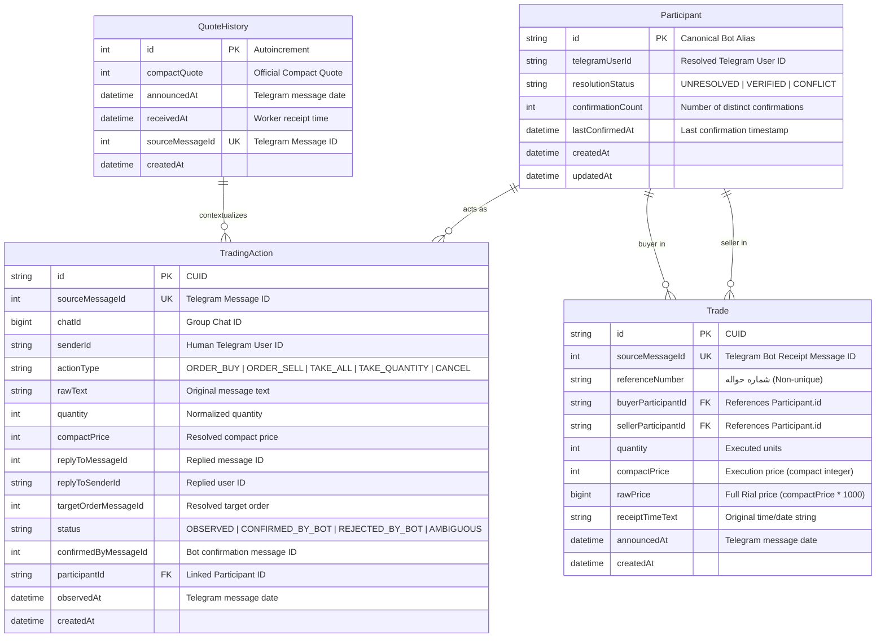
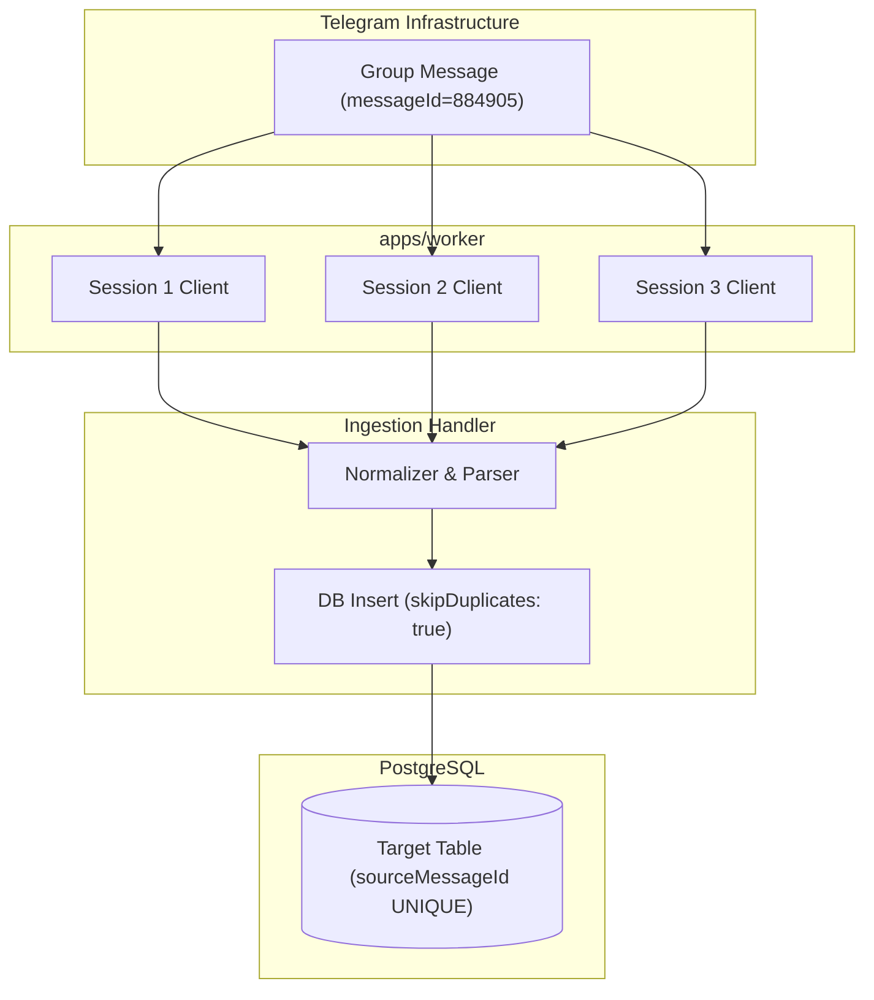

# ZarBit — Market Data Specification

> **Status:** Implemented (Phase 1 Data Foundation & Phase 2 Market Intelligence Engine)  
> **Primary Authority:** Persistence, ingestion architecture, identity resolution, query contracts, and retention policies.  
> **Complementary Authority:** `docs/GROUP-TRADING-PROTOCOL.md` (Telegram group trading syntax, message formats, and observed room mechanics).  
> **Primary Components:** `packages/db`, `packages/contracts`, `packages/domain`, `apps/worker`, `apps/server`, `apps/web`.

---

## 1. Purpose and Architecture Boundaries

This document defines the market data architecture and persistence models for ZarBit's market intelligence engine.

The system ingests canonical quotes, trade receipts, active orders, and human trading actions, serving real-time market snapshots and 7-day rolling performance analytics. Automated follow execution is deferred to Phase 3.

### Separation of Concerns

- `docs/GROUP-TRADING-PROTOCOL.md` owns the **observed Telegram group mechanics**, Persian syntax rules, order grammar, and message classifications.
- `docs/MARKET-DATA.md` (this document) owns the **application and persistence models**, database schema, MTProto ingestion pipeline, multi-session idempotency, conservative identity resolution, query contracts, and storage lifecycle.

---

## 2. Core Entities & Relational Schema

The PostgreSQL data model in `packages/db` is extended to persist four primary entities:

1. **`Participant`**: Canonical market actor identified by the bot-emitted alias.
2. **`TradingAction`**: Observed raw human trading intents (orders, takes, cancels) with full reply context.
3. **`Trade`**: `NORMAL` completed receipts and synthetic `SETTLEMENT` accounting closes. Only `NORMAL` trades contribute to market heads and request triggers.
4. **`QuoteHistory`**: Authoritative reference quotes from the group.



### 2.1 Entity Details

#### A. `Participant`

- **Canonical ID Rule:** The participant alias emitted by the group management bot (`رسول اُف`, `سناتور`, `مرداد`, etc.) is the canonical `Participant.id`.
- **Architectural Constraint:** Do NOT introduce a `ParticipantAlias` table. In this market, the bot-assigned Persian name is the primary canonical identifier within the order book and receipts.
- **Telegram Identity Link:** `telegramUserId` is optional and initially null. It is populated strictly through the deterministic identity resolver.
- **Resolution Statuses:**
  - `UNRESOLVED`: Default state. Insufficient distinct evidence to bind alias to a Telegram account.
  - `VERIFIED`: Confirmed by multiple distinct deterministic evidence events with zero contradictions.
  - `CONFLICT`: Contradictory evidence detected (two different Telegram accounts claimed or observed for the same alias). Frozen against automated operations.

#### B. `TradingAction`

- **Purpose:** Represents observed human trading actions required for future exact whale-following.
- **Fundamental Principle:** Future whale-following is **ACTION COPY, not confirmed-trade copy**. A followed trader's raw action is the future execution trigger once their Telegram identity is `VERIFIED`. Canonical bot messages and receipts are used for validation and reconciliation, not as the primary Follow trigger.
- **Action Types:**
  - `ORDER_BUY`: User sends an explicit buy order (e.g. `1خ104900`, `خ 700`, `۲خ۰۵۰`).
  - `ORDER_SELL`: User sends an explicit sell order (e.g. `۲ف۱۲۰`, `1 ف 105050`).
  - `TAKE_ALL`: User sends `ب` replying to an active order to take all remaining quantity.
  - `TAKE_QUANTITY`: User sends a numeric reply (e.g. `1`, `2`) replying to an active order.
  - `CANCEL`: User sends `ن` to cancel an active order.
- **Reply Context Capture:** Must capture `replyToMessageId` and `replyToSenderId` to reconstruct which order was targeted. If reply metadata is absent on contextual commands (`ب`, `1`, `ن`), the target order must be marked as `UNRESOLVED_TARGET`, never guessed.

#### C. `Trade`

- **Confirmation Boundary:** A `NORMAL` Trade exists only after an authoritative bot receipt (`حواله`). A `SETTLEMENT` Trade is a position close derived from a separately accepted Settlement event after coverage review.
- **Rule of Truth:** Canonical order messages (`🔵 ... 1 خ 104900 (مانده: 1)`) represent active liquidity, NOT completed trades. Even if an order's `مانده` decreases, the authoritative trade confirmation is strictly the bot receipt.
- **Non-Uniqueness of Reference Numbers:** Empirical analysis of 3,820 real group messages proved that `شماره حواله` is **NOT globally unique** (e.g. reference `6380` was issued twice on the same trading day for two completely different trades). Therefore:
  - `sourceMessageId` (Telegram message ID of the receipt) is the unique primary key constraint.
  - `referenceNumber` is stored as indexed business metadata, never as the unique database constraint.
- **Prices:**
  - `compactPrice`: Integer representation (e.g. `105000` for `105,000,000` Rials / `10,500,000` Tomans).
  - `rawPrice`: Exact BigInt Rial value printed on the receipt.

#### D. `QuoteHistory`

- **Current Baseline:** Already implemented in `packages/db` and Prisma migrations (`model QuoteHistory`), with `compactQuote`, `announcedAt`, `receivedAt`, and `sourceMessageId`.
- **Evaluation of Quote Source:**
  - _Raw publisher messages:_ Human quote publishers often send bare numbers without labels (e.g. `۱۰۴۹۵۰` or shorthand `۹۳۰`), which requires contextual guessing and introduces risk if publisher IDs change.
  - _Canonical bot quote messages:_ The group management bot always responds with standard, formatted messages (`🟡 مظنه: 105020 🟡`), using 6-digit compact integers in ASCII/Persian digits.
  - _Decision:_ Canonical bot quote messages (`senderId = GROUP_BOT_ID`) **replace raw publisher messages as the authoritative persisted quote source**. This guarantees 100% synchronization with the group's active reference quote, eliminates shorthand guesswork, and prevents failures if publisher accounts change. Compact prices convert to receipt/display Tomans by multiplying by 1000.

---

## 3. Idempotent Ingestion Pipeline

### 3.1 Multi-Session Architecture

The ZarBit worker manages up to 20 concurrent Telegram MTProto user sessions. When these sessions belong to members of the trading group, all connected sessions receive identical incoming group messages nearly simultaneously.



### 3.2 Idempotency Rules

1. **Source Message Keying:** Received `QuoteHistory`, `NORMAL Trade`, and `TradingAction` records retain Telegram message-ID uniqueness. Synthetic `SETTLEMENT Trade` rows have null `sourceMessageId` and are unique by settlement boundary and participant.
2. **Transaction Isolation:** Inserts are executed using `createMany({ skipDuplicates: true })` or `INSERT ... ON CONFLICT (sourceMessageId) DO NOTHING`.
3. **Observation Settlement:**
   - The first session transaction to commit persists the record and returns `count === 1`.
   - Subsequent transactions from concurrent sessions return `count === 0` and are safely ignored with debug logging.
4. **Decoupled Processing:** Ingestion handlers never make outbound MTProto calls inside database transactions.

### 3.3 MTProto Message Metadata Extraction

To eliminate the limitations of previous logs, the worker's MTProto subscription must extract complete message metadata:

```typescript
export interface ObservedGroupEvent {
  chatId: number;
  messageId: number;
  senderId: string;
  date: Date;
  text: string;

  // Reply context required for TradingAction reconstruction
  replyToMessageId?: number;
  replyToSenderId?: string;

  // Entity mentions for deterministic identity extraction
  entities?: Array<{
    type: string;
    offset: number;
    length: number;
    userId?: string; // Text mention entity containing Telegram User ID
  }>;
}
```

---

## 4. Conservative Alias → Telegram Identity Resolver

A core requirement for future whale-following is linking the bot-emitted participant alias (e.g. `سناتور`) to their actual Telegram user ID (`senderId`).

### 4.1 Non-Negotiable Resolver Constraints

- **Deterministic evidence only.**
- **NO fuzzy string matching** (e.g. matching Telegram user display name "Senator" to alias "سناتور" is strictly prohibited).
- **NO LLM inference or heuristic semantic guessing.**
- **NO display-name guessing.**
- **NO ambiguous correlation.**
- **Multiple distinct confirmations required** before any mapping is verified.
- **Conflicts must NEVER overwrite a verified mapping.**
- **UNRESOLVED is always preferable to a false mapping.** (In whale-following, a false mapping causes copying the wrong account; remaining unresolved simply avoids executing an unverified trade).

### 4.2 Evidence Qualification Levels

| Evidence Level                        | Description                                                                                                                                                                                                                     | Status Contribution                                                    |
| ------------------------------------- | ------------------------------------------------------------------------------------------------------------------------------------------------------------------------------------------------------------------------------- | ---------------------------------------------------------------------- |
| **Level 1 (Direct Platform Link)**    | Bot canonical order or receipt contains a direct Telegram `replyToMessageId` pointing to the user's raw message, OR an MTProto `text_mention` entity linking the alias to the user ID.                                          | Strongest deterministic proof. Increments confirmation count.          |
| **Level 2 (Isolated Sequence)**       | User sends order command $M_{user}$; Bot responds with canonical order $M_{bot}$ containing matching side, quantity, and price within $\Delta t \le 1.5$s, with **ZERO intervening messages** from any other user in the group. | Valid confirmation candidate ONLY if no other messages were in-flight. |
| **Level 3 (Ambiguous / Interleaved)** | Multiple user orders in flight, concurrent messages within the time window, or absence of reply metadata.                                                                                                                       | **REJECTED as evidence.** Discarded immediately.                       |

### 4.3 Resolver State Machine

```mermaid
stateDiagram-v2
    [*] --> UNRESOLVED: New Alias Observed

    UNRESOLVED --> CANDIDATE: 1 Valid Confirmation (Level 1 or 2)
    CANDIDATE --> CANDIDATE: 2nd Valid Confirmation (Same User)
    CANDIDATE --> VERIFIED: >= 5 distinct exact confirmations, zero conflicts

    UNRESOLVED --> CONFLICT: Contradictory Observation (User A != User B)
    CANDIDATE --> CONFLICT: Contradictory Observation (User A != User B)

    VERIFIED --> CONFLICT_FLAGGED: Incompatible Event Observed (Frozen; Never Overwritten)

    note right of VERIFIED
        Only VERIFIED participants
        may trigger automated
        whale-following in Phase 3.
    end note
```



1. **Threshold Requirement:** At least **5 distinct exact confirmations** ($K \ge 5$), each backed by a unique human-action/canonical-order message pair, with **zero contradictions** are required to transition from `UNRESOLVED` to `VERIFIED`. Duplicate observations of the same Telegram message do not add a confirmation.
2. **Conflict Resolution:** If alias $A$ is associated with user $U_1$, and subsequent valid evidence links alias $A$ to user $U_2$ ($U_1 \ne U_2$):
   - If in `UNRESOLVED` or `CANDIDATE`: The mapping immediately transitions to `CONFLICT`. It is locked from further automated transitions.
   - If already `VERIFIED`: The existing mapping is **NEVER overwritten**. The status transitions to `CONFLICT_FLAGGED` and requires manual review.

---

## 5. Market serving

The Home terminal reads market data via `GET /rpc/market.snapshot`:

- `QuoteHistory` provides the authoritative official quote; completed `NORMAL` receipts in `Trade` provide the latest trade and recent trades list.
- The server (`MarketState`) evaluates market heads via `store.marketHeads()`, querying the latest quote and up to 10 recent completed trades ordered by `sourceMessageId DESC`.
- Market heads are cached in memory on the server (5-second cache when offline/degraded, 60-second cache when connected).
- The web client (`useMarket`) polls `market.snapshot` every 3 seconds via TanStack Query (`marketPolling`).
- Monotonic head merging (`mergeMarketSnapshot`) prevents late HTTP responses from regressing visible market heads on the client.
- The signed spread on the dashboard is computed as `latest NORMAL Trade compact price - latest Quote compact price`.
- Only headline metrics convert to full Tomans (`compactPrice × 1000`). All secondary prices and request targets remain compact integers.

---

## 6. Retention vs. Analytics Policy

A strict distinction is maintained between **database retention** and **analytics query windows**:

### 6.1 Trade Retention

- **Policy:** **PERMANENT RETENTION**.
- **Rule:** Historical `Trade` records are **NEVER deleted or pruned**.
- **Rationale:** Complete historical trade data is required for long-term trader profiling, multi-month performance backtesting, and machine-learning model training in future phases.

### 6.2 Rolling 7-Day View

- **Policy:** **ANALYTICS WINDOW ONLY**.
- **Rule:** The 7-day period is strictly a query filter (`WHERE announcedAt >= NOW() - INTERVAL '7 days'`) for computing rolling leaderboards, trader win rates, and active whale rankings.
- **Warning:** 7 days must NEVER be configured as a database pruning TTL for trades.

### 6.3 QuoteHistory retention

QuoteHistory and Trade are retained permanently. Retaining raw QuoteHistory preserves canonical reference data for audit, debugging, and analytics. Official quotes remain the reference for shorthand message parsing. Request matching uses only confirmed trades, independently of dashboard caching.
