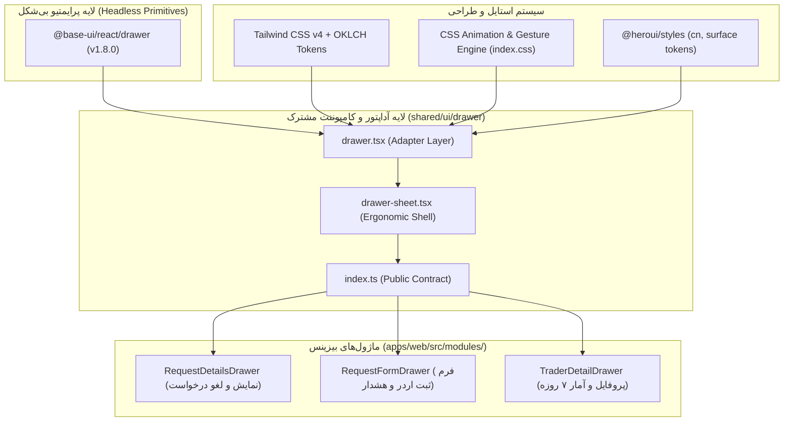

# گزارش ساختار کامپوننت‌های کشو و پرایمر کانتکست هوش مصنوعی (Drawer Component System Architecture & LLM Context)

**نسخه:** ۱.۰.۰  
**تاریخ گزارش:** ۲۰ سپتامبر ۲۰۲۶ (۳۰ شهریور ۱۴۰۵)  
**نوع سند:** گزارش فنی جامع معماری، تحلیل کتابخانه‌ها و راهنمای کانتکست پرامپت هوش مصنوعی (Technical Report & LLM Context Primer)  
**مخاطبان:** توسعه‌دهندگان فرانت‌اند، معماران سیستم، و مدل‌های زبانی بزرگ / ایجنت‌های کدنویسی (AI Coding Agents)  
**محدوده پروژه:** `apps/web/src/shared/ui/drawer/` و مصرف‌کنندگان در `apps/web/src/modules/`

---

## ۱. خلاصه‌ی اجرایی و معماری کلان (Executive Summary & Architecture)

در طراحی پلتفرم تحت وب پیش‌رونده (PWA) زاربیت (Zarbit)، کامپوننت **کشو (Drawer / Bottom Sheet)** به عنوان الگوی اصلی تعامل رابط کاربری موبایل برای نمایش فرم‌ها، جزئیات تراکنش‌ها، هشدارها و پروفایل‌های تحلیلی معامله‌گران انتخاب شده است. این مؤلفه تعاملی در لایه `apps/web/src/shared/ui/drawer/` متمرکز شده و با تکیه بر اصول طراحی نیتیو موبایل (iOS/Android Native Sheet Feel) پیاده‌سازی شده است.

### ارکان اصلی پشته نرم‌افزاری (Tech Stack Pillars)

1. **کتابخانه هسته حرکتی و دسترسی‌پذیری:** [`@base-ui/react/drawer`](https://base-ui.com/react/components/drawer) (نسخه `^1.8.0`)، یک پرایمتیو کاملاً بی‌شکل (Headless)، دسترسی‌پذیر (WAI-ARIA) و با فیزیک لمسی مبتنی بر متغیرهای CSS.
2. **سیستم استایل و تم رنگی:** `@heroui/styles` و کدهای کاربردی Tailwind CSS v4 (`@tailwindcss/vite` نسخه `^4.3.3`) مبتنی بر فضای رنگی مدرن `oklch` و متغیرهای معنایی تم (Dark/Light).
3. **موتور ترنزیشن و شتاب‌دهنده گرافیکی (GPU):** کنترل فریم‌های انیمیشن و سوایپ مستقیم از طریق ویژگی‌های CSS و Transform سه‌بعدی (`translate3d`) بدون سربار محاسبه در حلقه JavaScript.
4. **تطبیق‌پذیری موبایل و صفحه‌کلید مجازی:** استفاده از `Drawer.VirtualKeyboardProvider` و تابع‌های CSS مدرن نظیر `env(safe-area-inset-*)` و `100dvh` جهت تطابق با ناوبری و کیبورد گوشی‌های هوشمند.



---

## ۲. بررسی کتابخانه‌ها و منطق انتخاب (Library Evaluation & Rationale)

### ۲.۱. چرا `@base-ui/react/drawer` به جای Vaul یا Radix Dialog؟

بسیاری از پروژه‌های React از کتابخانه‌هایی مثل `vaul` یا `radix-ui/react-dialog` استفاده می‌کنند. در پروژه زاربیت، انتخاب `@base-ui/react/drawer` بر اساس دلایل مهندسی زیر صورت گرفته است:

| معیار مقایسه                 | `@base-ui/react/drawer` (انتخاب فعلی)                                   | `vaul` (کتابخانه محبوب دیگر)                         | `@heroui/react` Modal/Drawer                  |
| :--------------------------- | :---------------------------------------------------------------------- | :--------------------------------------------------- | :-------------------------------------------- |
| **طراحی هسته**               | کاملاً Headless، بدون استایل‌های نفوذی                                  | استایل‌های پیش‌فرض نفوذی روی DOM و Body              | بسته و وابسته به کامپوننت‌های درونی HeroUI    |
| **موتور فیزیک لمسی**         | رندر مستقیم متغیرهای CSS در لحظه لمس                                    | انیمیشن ترکیبی با CSS/JS                             | انیمیشن ایستا بدون کشش انگشت (Swipe Tracking) |
| **نقاط توقف (Snap Points)**  | پشتیبانی بومی با محاسبه متوالی (`snapToSequentialPoints`)               | پشتیبانی دارد اما روی PWA با باگ پرش مواجه می‌شود    | فاقد Snap Points شناور                        |
| **کیبورد مجازی موبایل**      | دارای `VirtualKeyboardProvider` داخلی و متغیر `--drawer-keyboard-inset` | نیاز به هک‌های دستی پدینگ و اسکرول                   | آسیب‌پذیر در برابر کیبورد iOS Safari          |
| **لغو خروج در فرم نامتقارن** | متد `details.cancel()` درون `onOpenChange`                              | پیچیدگی در intercept کردن بستن فرم کثیف              | متد بستن ساده بدون کنترل رویداد لمسی          |
| **پیش‌گیری از تداخل سوایپ**  | ویژگی صریح `data-base-ui-swipe-ignore`                                  | تکیه بر کلاس‌های متفرقه یا لایه‌های `pointer-events` | فاقد سیستم تشخیص هوشمند لمس فرم               |

### ۲.۲. ادغام با HeroUI و Tailwind CSS v4

پروژه زاربیت بر پایه Tailwind CSS v4 و بسته استایل `@heroui/styles` توسعه یافته است. کشو به جای تزریق استایل‌های هاردکد، از توکن‌های سمانتیک سیستم استفاده می‌کند:

- رنگ زمینه: `bg-surface` و `bg-surface-secondary`
- خطوط مرزی: `border-border` و `border-separator`
- وضعیت کنتراست متن: `text-foreground` و `text-muted`
- استایل‌های تأکیدی و بج‌ها: `bg-accent/12 text-accent`
- رنگ‌های هشدار و وضعیت: `bg-danger-soft text-danger-soft-foreground`

---

## ۳. کالبدشکافی ساختار فایل‌ها و لایه‌ها (File Structure Breakdown)

ساختار کد در دایرکتوری [`apps/web/src/shared/ui/drawer/`](file:///Users/mm25zamanian/Codes/zarbit/apps/web/src/shared/ui/drawer) به سه فایل اساسی تقسیم شده است:

```
apps/web/src/shared/ui/drawer/
├── index.ts           # نقطه ورودی عمومی (Public Seam & Types)
├── drawer.tsx         # لایه پایه آداپتور Base UI (Low-level Primitives)
└── drawer-sheet.tsx   # لایه کامپوزیشن آماده مصرف (Ergonomic Ready-to-use Sheet)
```

### ۳.۱. لایه آداپتور پایه: [`drawer.tsx`](file:///Users/mm25zamanian/Codes/zarbit/apps/web/src/shared/ui/drawer/drawer.tsx)

این فایل تمام اجزای بی‌شکل `@base-ui/react/drawer` را دریافت کرده، استایل‌های ساختاری و کلاس‌های تم پروژه را به آن‌ها الحاق می‌کند و به صورت یک شئ واحد تحت عنوان `Drawer` اکسپورت می‌نماید.

#### اجزای اکسپورت‌شده:

1. **`Drawer.Root`**: کنترل‌کننده وضعیت باز/بسته بودن، جهت سوایپ، نقاط توقف و منطق رویدادها.
2. **`Drawer.Backdrop`**: پرده تیره پشت کشو (`bg-black/50 backdrop-blur-xs z-60`). این کامپوننت با متغیر `--drawer-swipe-progress` به صورت لحظه‌ای با سوایپ کاربر شفاف یا مات می‌شود.
3. **`Drawer.Viewport`**: کانتینر تمام‌صفحه با موقعیت `fixed inset-0 z-60 touch-none items-end justify-center`. وظیفه این بخش جلوگیری از رفتارهای ناخواسته اسکرول صفحه زیرین و چیدمان کشو در پایین صفحه است.
4. **`Drawer.Popup`**: بدنه اصلی شیت با استایل‌های `.zarbit-drawer-popup`، گوشه‌های گرد بالا (`rounded-t-4xl sm:rounded-4xl`) و حاشیه حداکثر ارتفاع متناسب با صفحه (`max-h-[calc(100vh-5.5rem)]`).
5. **`Drawer.Content`**: بخش محتوای داخلی دارای اسکرول خودکار (`overflow-y-auto overscroll-contain touch-auto`). توجه فرمایید که `touch-auto` به مرورگر اجازه می‌دهد هنگام اسکرول محتوای درونی، تداخلی با کشیدن کل کشو پیش نیاید.
6. **`Drawer.Title` و `Drawer.Description`**: برچسب‌های متنی با مشخصات استاندارد عنوان و توضیح که به صورت خودکار به `aria-labelledby` و `aria-describedby` کشو متصل می‌شوند.
7. **`Drawer.Close`**: دکمه دسترسی‌پذیر بستن با ترنزیشن و افکت کلیک `active:scale-95`.
8. **`Drawer.Trigger`**: تریگر باز کردن کشو که استایل‌های فوکوس سیستم را اعمال می‌کند.
9. **`Drawer.VirtualKeyboardProvider`**: لایه تطبیق کیبورد لمسی موبایل.
10. **`Drawer.SwipeArea`، `Drawer.Indent`، `Drawer.IndentBackground` و `Drawer.Portal`**: فراهم‌کننده پورتال رندر و افکت‌های مقیاس‌گذاری صفحه زیرین.

---

### ۳.۲. پوسته آماده مصرف: [`drawer-sheet.tsx`](file:///Users/mm25zamanian/Codes/zarbit/apps/web/src/shared/ui/drawer/drawer-sheet.tsx)

برای جلوگیری از تکرار کد (Boilerplate) در صفحات مختلف، کامپوننت `DrawerSheet` یک قالب استاندارد و ارگونومیک بر روی `Drawer` فراهم می‌کند.

#### ساختار بصری و چیدمان داخلی `DrawerSheet`:

```
┌─────────────────────────────────────────────────────────┐
│                      Drawer.Popup                       │
│  ┌───────────────────────────────────────────────────┐  │
│  │ <header> (touch-none select-none)                 │  │
│  │    [ ─────── ]  <- دستگیره کشیدن (Handle Pill)    │  │
│  │    [Icon] Title                                   │  │
│  │           Description                             │  │
│  └───────────────────────────────────────────────────┘  │
│  ┌───────────────────────────────────────────────────┐  │
│  │ <Drawer.Content> (touch-auto, overflow-y-auto)     │  │
│  │                                                   │  │
│  │               محتوای داخلی اسکرول‌پذیر              │  │
│  │               (Children View / Form)              │  │
│  │                                                   │  │
│  └───────────────────────────────────────────────────┘  │
│  ┌───────────────────────────────────────────────────┐  │
│  │ <footer> (sticky bottom, safe-area + keyboard)    │  │
│  │    [ دکمه‌های عملیاتی / Actions / Buttons ]        │  │
│  └───────────────────────────────────────────────────┘  │
└─────────────────────────────────────────────────────────┘
```

#### ویژگی‌های کلیدی `DrawerSheet`:

- **دستگیره کشیدن بصری (Pill Handle):** یک خط خاکستری رنگ (`bg-separator mx-auto mt-3 h-1.5 w-12 rounded-full`) در بالای کشو که نقش نشانگر بصری را برای کشیدن رو به پایین ایفا می‌کند.
- **هدر یکپارچه با آیکون:** امکان ارسال پروپ `icon` که در کادری شکیل با پس‌زمینه کم‌رنگ آکسنت قرار می‌گیرد (`bg-accent/12 text-accent size-10 rounded-2xl`).
- **فوتر مجهز به Insetهای امنیتی و کیبورد:**
  ```tsx
  <footer className="border-separator shrink-0 border-t px-4 pb-[max(1rem,env(safe-area-inset-bottom),var(--drawer-keyboard-inset,0px))] pt-4 sm:px-6">
    {footer}
  </footer>
  ```
  این استایل تضمین می‌کند که فوتر در آیفون‌ها روی دکمه Home Bar نیفتد و با باز شدن کیبورد نرم‌افزاری، فوتر دقیقاً بالای صفحه کلید بنشیند.
- **تنظیمات پیش‌فرض اسنپ پوینت:** به طور پیش‌فرض دارای دو نقطه توقف ۵۰ درصد و ۱۰۰ درصد است:
  ```tsx
  snapPoints={snapPoints ?? [0.5, 1]}
  defaultSnapPoint={defaultSnapPoint ?? (snapPoints ? undefined : 0.5)}
  snapToSequentialPoints
  swipeDirection="down"
  ```

---

### ۳.۳. درگاه خروجی: [`index.ts`](file:///Users/mm25zamanian/Codes/zarbit/apps/web/src/shared/ui/drawer/index.ts)

این فایل به عنوان قرارداد بیرونی (Module Boundary) عمل کرده و تایپ‌های کامل TypeScript به همراه اشیاء `Drawer` و `DrawerSheet` را اکسپورت می‌کند تا سایر بخش‌های برنامه هیچ‌گاه مستقیماً به وابستگی خارجی `@base-ui/react/drawer` وصل نشوند.

---

## ۴. معماری استایل، فیزیک لمسی و انیمیشن‌ها در CSS

موتور عملکردی انیمیشن کشو در [`apps/web/src/index.css`](file:///Users/mm25zamanian/Codes/zarbit/apps/web/src/index.css#L171-L223) درون لایه `@layer components` پیاده‌سازی شده است. در ادامه نحوه تعامل کدهای CSS با فیزیک کتابخانه تشریح شده است:

### ۴.۱. متغیرهای داینامیک CSS تزریق‌شده توسط Base UI

هنگامی که کاربر انگشت خود را روی صفحه می‌گذارد و کشو را جابجا می‌کند، Base UI بدون ایجاد Re-render در کامپوننت React، متغیرهای CSS زیر را مستقیماً روی استایل المنت پاپ‌آپ و بک‌دراپ به روز می‌کند:

1. `--drawer-swipe-progress`: عدد اعشاری بین `0` و `1` که نشان‌دهنده درصد پیشرفت بسته‌شدن با سوایپ است.
2. `--drawer-swipe-movement-y`: مقدار جابجایی عمودی بر حسب پیکسل (`px`) در لحظه لمس.
3. `--drawer-snap-point-offset`: فاصله پیکسلی از بالای کانتینر برای اسنپ‌پوینت فعلی.
4. `--drawer-swipe-strength`: ضریب شتاب و تکانه سوایپ (Velocity Factor) که در لحظه رهاسازی برای محاسبه مدت انیمیشن خروج به کار می‌رود.
5. `--drawer-keyboard-inset`: ارتفاع کیبورد نرم‌افزاری بازشده در صفحه.

### ۴.۲. تحلیل کدهای CSS در `index.css`

```css
@layer components {
  /* ۱. استایل بک‌دراپ */
  .zarbit-drawer-backdrop {
    opacity: calc(1 - var(--drawer-swipe-progress, 0));
    transition: opacity 450ms cubic-bezier(0.32, 0.72, 0, 1);
    will-change: opacity;
  }

  /* در زمان سوایپ، انیمیشن غیرفعال می‌شود تا با تاخیر مواجه نشود */
  .zarbit-drawer-backdrop[data-swiping] {
    transition-duration: 0ms;
  }

  /* ۲. استایل کانتینر پاپ‌آپ کشو */
  .zarbit-drawer-popup {
    --zarbit-drawer-top-margin: max(0.75rem, env(safe-area-inset-top, 0px));
    box-sizing: border-box;
    height: calc(100dvh - var(--zarbit-drawer-top-margin));
    max-height: calc(100dvh - var(--zarbit-drawer-top-margin));
    overflow: visible;
    /* جلوگیری از خالی شدن زیر کشو هنگام کشیدن به سمت بالا */
    padding-bottom: max(
      0px,
      calc(
        var(--drawer-snap-point-offset, 0px) +
          var(--drawer-swipe-movement-y, 0px)
      )
    );
    /* جابجایی دقیق فیزیکی بر اساس اسنپ پوینت و حرکت دست */
    transform: translate3d(
      0,
      calc(
        var(--drawer-snap-point-offset, 0px) +
          var(--drawer-swipe-movement-y, 0px)
      ),
      0
    );
    transition:
      transform 450ms cubic-bezier(0.32, 0.72, 0, 1),
      box-shadow 450ms cubic-bezier(0.32, 0.72, 0, 1);
    will-change: transform;
  }

  /* صفر کردن زمان ترنزیشن حین لمس فعال */
  .zarbit-drawer-popup[data-swiping] {
    transition-duration: 0ms;
  }

  /* وضعیت‌های بسته، شروع و پایان ترنزیشن */
  .zarbit-drawer-popup[data-starting-style],
  .zarbit-drawer-popup[data-ending-style],
  .zarbit-drawer-popup[data-closed] {
    transform: translate3d(0, calc(100% + 2px), 0);
    padding-bottom: 0;
  }

  /* تطبیق داینامیک سرعت خروج با شدت پرتاب دست (Fling Momentum) */
  .zarbit-drawer-popup[data-ending-style] {
    transition-duration: calc(var(--drawer-swipe-strength, 1) * 400ms);
  }
}
```

#### نکات برجسته معماری CSS:

- **منحنی شتاب اپل (`cubic-bezier(0.32, 0.72, 0, 1)`):** این منحنی همان شتاب استاندارد حرکتی در iOS است که حس کاملاً ارگانیک و جهنده (Spring-like) به بسته‌شدن و بازشدن کشو می‌دهد.
- **تکنیک ضد خلاء سوایپ بالا (`padding-bottom`):** وقتی کاربر کشو را از حالت ۵۰٪ به ۱۰۰٪ یا بالاتر می‌کشد، ممکن است بخش انتهایی کشو بالاتر بیاید و زیر آن خالی شود؛ محاسبه هوشمند `padding-bottom` با فرمول بالا تضمین می‌کند که زیر کشو همواره پیوسته به نظر برسد.
- **استفاده از `100dvh` و `safe-area-inset-top`:** ارتفاع کلی کشو بر اساس Dynamic Viewport Height منهای حاشیه بالای صفحه (Notch / Dynamic Island) تنظیم شده است.

---

## ۵. تحلیل مصرف‌کنندگان عملیاتی در پروژه (Production Consumers)

در حال حاضر سه ماژول اصلی در پروژه از سیستم کشو استفاده می‌کنند که هر کدام الگوی تعاملی خاصی را نشان می‌دهند:

### ۵.۱. ماژول `RequestDetailsDrawer` (الگوی نمایش مشخصات و عملیات فوری)

- **مسیر فایل:** [`apps/web/src/modules/requests/_request-details-drawer.tsx`](file:///Users/mm25zamanian/Codes/zarbit/apps/web/src/modules/requests/_request-details-drawer.tsx)
- **هدف:** نمایش جزئیات یک اردر شرطی خرید، فروش یا هشدار به همراه دکمه‌های کنترلی «ارسال فوری» و «لغو درخواست».
- **ویژگی‌های کلیدی:**
  - کنترل باز بودن با `open={!!selectedId}`.
  - پولینگ خودکار با TanStack Query تنها در زمان فعال بودن درخواست (`status === "ACTIVE" ? 3000 : false`).
  - رندر ساختاریافته فیلدها با تگ‌های معنایی `<dl>`, `<dt>`, `<dd>`.
  - **استفاده از `data-base-ui-swipe-ignore` روی دکمه‌ها:** روی دکمه‌های درون فوتر صفت `data-base-ui-swipe-ignore` اضافه شده تا لمس و فشار دادن دکمه ارسال/لغو توسط موتور سوایپ کشو به عنوان حرکت شیت تفسیر نشود.

### ۵.۲. ماژول `RequestFormDrawer` (الگوی فرم، تغییرات ذخیره‌نشده و لغو سوایپ)

- **مسیر فایل:** [`apps/web/src/modules/requests/_request-form-drawer.tsx`](file:///Users/mm25zamanian/Codes/zarbit/apps/web/src/modules/requests/_request-form-drawer.tsx)
- **هدف:** فرم تعاملی ثبت سفارش خرید/فروش یا تنظیم هشدار با کنترل‌های عددی (`NumberField`).
- **ویژگی‌های پیشرفته مهندسی:**
  1. **ردیابی فرم تغییریافته (`isDirty`):** تغییرات کاربر در قیمت یا فیلدها رصد می‌شود.
  2. **مسدودسازی بستن سوایپ با `details.cancel()`:**
     ```tsx
     <DrawerSheet
       onOpenChange={(nextOpen, details) => {
         if (!nextOpen && (pending || isDirty)) {
           // لغو رویداد بسته‌شدن کشو!
           details.cancel();
           if (!pending) setDiscardOpen(true);
           return;
         }
         if (!nextOpen) reset();
         onOpenChange(nextOpen);
       }}
       open={open}
       ...
     >
     ```
     اگر کاربر حین ویرایش فرم، ناخودآگاه دستش بخورد و شیت را به پایین بکشد، رویداد بسته شدن توسط `details.cancel()` لغو شده و یک دیالوگ تأییدیه (`AlertDialog`) برای خروج از فرم نمایش داده می‌شود.
  3. **محافظت از اینپوت‌های لمسی:** دکمه‌های شمارنده و ورودی `NumberField` مجهز به `data-base-ui-swipe-ignore` هستند تا فشردن کلیدهای + و - یا تایپ، باعث بسته‌شدن شیت نشود.

### ۵.۳. ماژول `TraderDetailDrawer` (الگوی داشبورد تحلیلی و لیست اسکرول‌شونده)

- **مسیر فایل:** [`apps/web/src/modules/traders/_trader-detail-drawer.tsx`](file:///Users/mm25zamanian/Codes/zarbit/apps/web/src/modules/traders/_trader-detail-drawer.tsx)
- **هدف:** نمایش خلاصه عملکرد، سود و زیان (P&L)، وضعیت موقعیت باز، و فهرست معاملات اخیر یک معامله‌گر در گروه تلگرام.
- **ویژگی‌های کلیدی:**
  - چیدمان ترکیبی کارت‌های متریک دو ستونه (`grid grid-cols-2`).
  - رندر وضعیت ریسک داده با کامپوننت `DataCoverageBadge`.
  - استفاده از `ScrollShadow` برای لیست تاریخچه معاملات اخیر با حداکثر ارتفاع مشخص (`max-h-56`) به گونه‌ای که اسکرول روان محتوا با اسکرول بدنه کشو تداخل نداشته باشد.

---

## ۶. کانتکست مرجع و راهنمای مدل‌های زبانی (LLM Context & Prompt Primer)

> [!TIP]
> این بخش به عنوان یک بسته دانشی کامل (System/Agent Context) طراحی شده است تا بتوانید آن را مستقیماً در حافظه یا پرامپت هر ایجنت کدنویسی یا LLM تزریق کنید تا کامپوننت‌های کشو را بدون خطا، با هماهنگی کامل و منطبق بر قراردادهای معماری زاربیت بسازد یا اصلاح کند.

````markdown
### Zarbit Drawer System Knowledge Context for LLMs

#### 1. Core Concepts & Conventions

- **Location:** All drawer shared components reside in `@/shared/ui/drawer` (aliased or relative to `src/shared/ui/drawer`).
- **Primary Export:** Use `DrawerSheet` for standard sheets (headers, handle pill, scrollable content, sticky safe-area footer). Use `Drawer.*` low-level primitives ONLY when bespoke multi-layer chrome or deeply customized triggers are needed.
- **Language & Direction:** The UI is strictly RTL (Persian/Farsi). Text alignment, margins, and icons must follow RTL best practices (use logical properties like `rounded-s-`, `rounded-e-`, `start-`, `end-`, `text-right` or `text-left` for numbers).
- **Numbers:** Numbers and currencies should be formatted with `formatNumber(...)` from `@zarbit/format`.

#### 2. Component API Reference

##### `DrawerSheet` Props:

```typescript
interface DrawerSheetProps {
  // Required
  open: boolean;
  onOpenChange: (open: boolean, details: DrawerOpenChangeDetails) => void;
  title: React.ReactNode;
  children: React.ReactNode;

  // Optional Customization
  description?: React.ReactNode;
  icon?: React.ReactNode; // Placed in a standard 40x40 accent badge
  footer?: React.ReactNode; // Anchored to bottom, safe-area & virtual keyboard padded
  snapPoints?: number[]; // Default: [0.5, 1]
  defaultSnapPoint?: number; // Default: 0.5 (or undefined if snapPoints custom)

  // Inherited from Base UI Drawer.Root
  dismissible?: boolean; // Default: true
  modal?: boolean; // Default: true
}
```
````

#### 3. Strict Rules & Golden Patterns for LLM Code Generation

1. **RULE 1: Interactive Elements Must Have `data-base-ui-swipe-ignore`**
   Any clickable element inside the drawer that could be tapped or dragged—especially `<Button>`, `<input>`, `<Select>`, or tab items—MUST include the attribute `data-base-ui-swipe-ignore`. Without this, Base UI's touch tracker may intercept the tap/gesture as an attempt to swipe down the drawer.

   ```tsx
   <Button data-base-ui-swipe-ignore onPress={handleAction}>
     تأیید
   </Button>
   ```

2. **RULE 2: Form Dirty-Check Interception via `details.cancel()`**
   If creating a form drawer with unsaved state, intercept the closing swipe gesture:

   ```tsx
   onOpenChange={(nextOpen, details) => {
     if (!nextOpen && isDirty) {
       details.cancel(); // Aborts the drawer close!
       setShowDiscardConfirmation(true);
       return;
     }
     onOpenChange(nextOpen);
   }}
   ```

3. **RULE 3: Safe Area Insets on Footers**
   Do not add arbitrary bottom margins or paddings to the footer. `DrawerSheet` already incorporates:
   `pb-[max(1rem,env(safe-area-inset-bottom),var(--drawer-keyboard-inset,0px))]`
   Keep your footer content clean (typically flex rows of full-width buttons).

4. **RULE 4: Scrollable Inner Content**
   Never place an infinite-height unconstrained container without flex. Inside `DrawerSheet`, `children` are wrapped in `<Drawer.Content className="min-h-0 flex-1 touch-auto overflow-y-auto overscroll-contain">`. If nesting a sub-list (like trade history), constrain its height (`max-h-56` or similar) or use `ScrollShadow`.

5. **RULE 5: Semantic Tokens Over Hardcoded Colors**
   Always use semantic classes:
   - Surfaces: `bg-surface`, `bg-surface-secondary`
   - Borders: `border-border`, `border-separator`
   - Typography: `text-foreground`, `text-muted`
   - Feedback: `text-danger`, `bg-danger-soft`, `text-success`

````

---

## ۷. الگوی پیاده‌سازی و مرجع کد (Copy-Paste Ready Implementation Recipe)

در ادامه یک نمونه کد استاندارد و کامل برای پیاده‌سازی یک کشوی جدید در پروژه زاربیت آورده شده است. این الگو شامل کلیه استانداردهای پروژه، مدیریت لودینگ، خطایابی، استایل RTL و قوانین سوایپ لمسی است:

```tsx
import { useState } from "react";
import { Button, Input } from "@heroui/react";
import { InfoCircleIcon } from "@solar-icons/react/linear/info-circle";
import { DrawerSheet } from "@/shared/ui/drawer";

export interface CustomFeatureDrawerProps {
  open: boolean;
  onOpenChange: (open: boolean) => void;
  onSuccess?: () => void;
}

export function CustomFeatureDrawer({
  open,
  onOpenChange,
  onSuccess,
}: CustomFeatureDrawerProps) {
  const [value, setValue] = useState("");
  const [pending, setPending] = useState(false);
  const [error, setError] = useState<string | null>(null);
  const isDirty = value.length > 0;

  const handleClose = () => {
    setValue("");
    setError(null);
    onOpenChange(false);
  };

  const handleSubmit = async (e: React.FormEvent) => {
    e.preventDefault();
    if (!value.trim()) {
      setError("لطفاً مقدار معتبری وارد کنید.");
      return;
    }

    setPending(true);
    setError(null);
    try {
      // شبیه‌سازی فراخوانی سرور / Mutation
      await new Promise((res) => setTimeout(res, 1000));
      handleClose();
      onSuccess?.();
    } catch {
      setError("خطایی در انجام عملیات رخ داد.");
    } finally {
      setPending(false);
    }
  };

  return (
    <DrawerSheet
      open={open}
      onOpenChange={(nextOpen, details) => {
        // جلوگیری از خروج تصادفی کاربر در صورت وجود دیتای ذخیره نشده
        if (!nextOpen && isDirty && !pending) {
          details.cancel();
          const confirmed = window.confirm("آیا مایل به خروج بدون ذخیره تغییرات هستید؟");
          if (confirmed) handleClose();
          return;
        }
        if (!nextOpen) handleClose();
      }}
      title="عنوان کشوی سفارشی"
      description="توضیحات تکمیلی کشو در این بخش قرار می‌گیرد."
      icon={<InfoCircleIcon size={22} />}
      footer={
        <div className="flex w-full gap-3">
          <Button
            data-base-ui-swipe-ignore
            fullWidth
            type="submit"
            form="custom-drawer-form"
            isPending={pending}
            variant="primary"
          >
            تأیید و ذخیره
          </Button>
          <Button
            data-base-ui-swipe-ignore
            isDisabled={pending}
            onPress={handleClose}
            variant="secondary"
          >
            انصراف
          </Button>
        </div>
      }
    >
      <form
        id="custom-drawer-form"
        onSubmit={handleSubmit}
        className="flex flex-col gap-4 py-2"
      >
        <div className="space-y-1">
          <label className="text-foreground text-sm font-medium">
            نام یا شناسه
          </label>
          <Input
            data-base-ui-swipe-ignore
            value={value}
            onChange={(e) => setValue(e.target.value)}
            placeholder="مثلاً: شناسه معامله‌گر"
            fullWidth
          />
        </div>

        {error ? (
          <p className="border-danger bg-danger-soft text-danger-soft-foreground rounded-xl border px-3 py-2 text-sm">
            {error}
          </p>
        ) : null}
      </form>
    </DrawerSheet>
  );
}
````

---

## ۸. چک‌لیست بازبینی کیفیت برای ایجنت‌ها و کدنویسان (Verification Checklist)

قبل از تأیید یا مرج هر کدی که با کشو در زاربیت سر و کار دارد، موارد زیر باید بررسی گردند:

- [ ] **صفت `data-base-ui-swipe-ignore`:** آیا روی تمامی دکمه‌ها، اینپوت‌ها و المنت‌های تعاملی درون کشو قرار گرفته است؟
- [ ] **مدیریت کیبورد مجازی:** آیا در فرم‌های دارای فیلد متنی، از قرارگیری دکمه سابمیت در فوتر استاندارد با افست کیبورد اطمینان حاصل شده است؟
- [ ] **انطباق RTL:** آیا آیکون‌ها و فاصله‌ها از خصوصیات منطقی (`start/end`) استفاده می‌کنند و تراز اعداد انگلیسی با اعداد فارسی خوانا است؟
- [ ] **لغو خروج در فرم‌های کثیف:** آیا تغییر وضعیت `open` به `false` در صورت پر بودن فرم توسط کاربر متوقف و تأییدیه گرفته می‌شود؟
- [ ] **عدم پرش اسکرول:** آیا کانتینر درونی دارای `touch-auto` و `overscroll-contain` است تا از اسکرول خوردن ناخواسته کل صفحه در iOS جلوگیری شود؟
- [ ] **رعایت توکن‌های معنایی:** آیا از رنگ‌های خام مانند `bg-white` یا `text-black` پرهیز شده و توکن‌های `bg-surface` و `text-foreground` به کار رفته‌اند؟

---

_گزارش تدوین شده بر پایه سورس‌کد رسمی زاربیت در ریپازیتوری `gecut/zarbit`._
