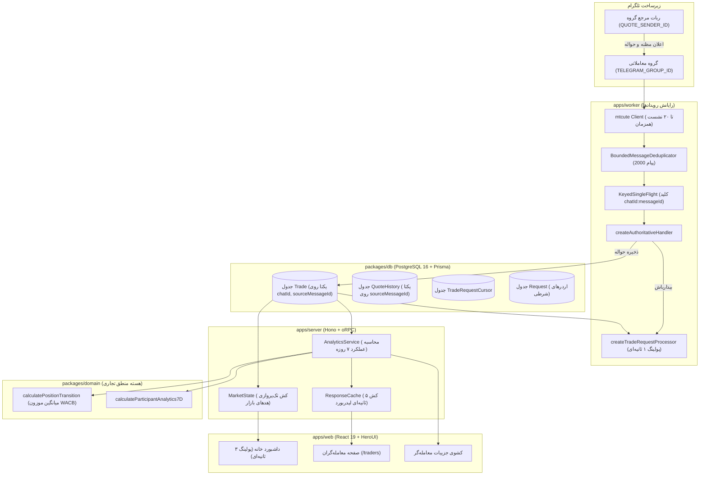

# گزارش ممیزی امکان‌سنجی پیاده‌سازی قابلیت تسویه (Settlement Feasibility Audit)

**تاریخ ممیزی:** ۲۰ سپتامبر ۲۰۲۶ (۳۰ شهریور ۱۴۰۵)  
**نوع گزارش:** ممیزی فنی، ساختاری، محاسباتی و داده‌محور بر پایه سورس‌کد موجود (Read-Only Deep Source Audit)  
**مخاطب اصلی:** معمار سیستم و عامل برنامه‌ریزی (GPT-6 Astra Planning Agent)  
**دامنه:** تمامی پکیج‌ها و اپلیکیشن‌های مونوریپو (`apps/worker`, `apps/server`, `apps/web`, `packages/db`, `packages/domain`, `packages/contracts`, `packages/logger`)  
**وضعیت تصمیمات مصوب:** تصمیمات تجاری فاز ۲ نهایی و غیرقابل تغییر فرض شده و صرفاً امکان‌سنجی، سازگاری فنی و ریسک‌های اجرایی ارزیابی شده‌اند.

---

## ۱. خلاصه‌ی مدیریتی (Executive Summary)

این گزارش، ارزیابی جامع و مبتنی بر شواهد قطعی سورس‌کد (Evidence-based) برای پیاده‌سازی **قابلیت تسویه دوره پایاپای (Settlement)** در پلتفرم زاربیت (ZarBit) است. هدف از قابلیت تسویه، صفر کردن موقعیت باز تمامی معامله‌گران در پایان دوره‌های معاملاتی از طریق ثبت رویداد تسویه و معاملات جبرانی (Synthetic Trades) بر اساس پیام رسمی ربات گروه تلگرام با نرخ مصوب تسویه است.

### نتیجه‌گیری نهایی امکان‌سنجی (Feasibility Verdict)
> **امکان‌پذیر با رعایت ۵ پیش‌شرط اصلاحی بحرانی (FEASIBLE WITH CRITICAL GUARDS)**  
> پیاده‌سازی قرارداد تسویه با معماری فعلی زاربیت از منظر ظرفیت پایگاه‌داده، مدل ریاضیاتی موتور حسابداری و خط لوله‌ی پردازش تلگرام سازگار و شدنی است؛ اما اجرای آن **بدون اصلاح ۵ مخاطره‌ی بحرانی (P0)** مستقیماً منجر به **نقض یکپارچگی پایگاه داده (Unique Constraint Violation)، آلودگی هدهای بازار (Market Snapshot Pollution)، تریگر اشتباه اردرهای کاربران (Erroneous Request Triggers) و خرابی اعتبارسنجی ران‌تایم Zod در کلاینت** خواهد شد.

### خلاصه کمی یافته‌های ممیزی
- **یافته‌های بحرانی (P0):** ۵ مورد (انسداد قطعی سیستم و فساد محاسباتی در صورت عدم رفع)
- **یافته‌های با اولویت بالا (P1):** ۵ مورد (ریسک‌های معماری، عدم بازیابی در قطعی ورکر، و فقدان شواهد متن خام)
- **یافته‌های با اولویت متوسط (P2):** ۳ مورد (تناقضات مستندات، فیلدهای غیرفعال دامین و بهبودهای تجربه کاربری)
- **شواهد متن خام مفقود:** نمونه پیام خام تلگرامی تسویه در سورس‌کد/تست‌ها وجود ندارد و صرفاً از روی اسکرین‌شات توصیف شده است.

---

## ۲. معماری تاییدشده فعلی (Verified Current Architecture)

بر اساس بازرسی خط‌به‌خط سورس‌کد در تعهدات کاری، مرزهای معماری زیر مستقیماً تایید شدند:



### اجزای کلیدی و رفتار محقق‌شده:
1. **نشست‌های چندگانه MTProto:** ورکر زاربیت در [`apps/worker/src/sessions.ts:239`](file:///Users/mm25zamanian/Codes/zarbit/apps/worker/src/sessions.ts#L239) تا ۲۰ نشست همزمان را مدیریت می‌کند. تمامی نشست‌های فعال، پیام‌های گروه را تقریباً همزمان دریافت می‌کنند.
2. **دیده‌بانی تلگرام:** در [`apps/worker/src/mtcute.ts:164-208`](file:///Users/mm25zamanian/Codes/zarbit/apps/worker/src/mtcute.ts#L164-L208)، رویدادها صرفاً از طریق `dispatcher.onNewMessage` دریافت می‌شوند. هیچ لیسنری برای `onEditMessage` یا `onDeleteMessage` ثبت نشده است.
3. **لایه عدم تکرار (Deduplication):** رویدادها ابتدا توسط [`BoundedMessageDeduplicator`](file:///Users/mm25zamanian/Codes/zarbit/apps/worker/src/message-deduplicator.ts#L5) فیلتر شده و سپس از طریق [`KeyedSingleFlight`](file:///Users/mm25zamanian/Codes/zarbit/apps/worker/src/keyed-single-flight.ts#L7) با کلید `${chatId}:${messageId}` همگام می‌شوند.
4. **تعهد ماندگاری پایمی:** مطابق [`docs/POSTGRES.md:43`](file:///Users/mm25zamanian/Codes/zarbit/docs/POSTGRES.md#L43) و [`packages/db/src/market-data.ts`](file:///Users/mm25zamanian/Codes/zarbit/packages/db/src/market-data.ts)، جداول `Trade` و `QuoteHistory` دائمی هستند و هرگز هرس (Prune) نمی‌شوند.
5. **استخر اتصالات دیتابیس:** در [`packages/db/src/index.ts:15-19`](file:///Users/mm25zamanian/Codes/zarbit/packages/db/src/index.ts#L15-L19)، متغیر `DATABASE_POOL_MAX` برابر ۵ اتصال به ازای هر پروسس (مجموعاً ۱۰ اتصال در ران‌تایم) است.

---

## ۳. سازگاری با قرارداد مصوب تسویه (Settlement Contract Compatibility)

جدول زیر سازگاری بندهای تصمیم تجاری مصوب (بخش ۲ درخواست) را با کدهای پیاده‌سازی‌شده فعلی مقایسه می‌کند:

| بند قرارداد | وضعیت پیاده‌سازی در کد | درجه تطابق | تحلیل و ریسک‌های موجود |
| :--- | :--- | :---: | :--- |
| **۲.۱ تریگر پیام تلگرام ربات** | ورکر روی `event.senderId === config.senderId` فیلتر می‌کند ([`market-ingestion.ts:203`](file:///Users/mm25zamanian/Codes/zarbit/apps/worker/src/market-ingestion.ts#L203)) | **سازگار** | نیاز به اضافه شدن پارسر تسویه به `authoritativeHandler`. متن دقیق در سورس مفقود است. |
| **۲.۱ تبدیل قیمت تسویه ($\times 1000$)** | در [`packages/domain/src/analytics/constants.ts:8`](file:///Users/mm25zamanian/Codes/zarbit/packages/domain/src/analytics/constants.ts#L8) نرخ ۱۰۰۰ پیاده شده است. | **کاملاً منطبق** | قیمت ورودی مثلاً `102980000` به عدد فشرده `102980` تبدیل می‌شود. |
| **۲.۲ محاسبه موقعیت خالص** | فرمول $Net = Buy - Sell$ در دامنه پیاده شده است. | **کاملاً منطبق** | در خطوط ۶۱-۲۰۶ فایل [`calculate-position.ts`](file:///Users/mm25zamanian/Codes/zarbit/packages/domain/src/analytics/calculate-position.ts#L61-L206) تغییرات موقعیت محاسبه می‌شود. |
| **۲.۲ مرزبندی با messageId** | کوئری‌های دیتابیس با `sourceMessageId` فیلتر می‌شوند. | **مشروط** | نیاز به ایجاد شرط اکید `> prevSettlementId AND < currentSettlementId`. |
| **۲.۳ ماندگاری در Trade** | جدول `Trade` صرفاً حواله‌های عادی دوطرفه را پشتیبانی می‌کند. | **ناسازگار (P0)** | فیلدهای خریدار و فروشنده `NOT NULL` هستند و قید یکتایی `UNIQUE(chatId, sourceMessageId)` مانع درج معاملات سینتتیک متعدد است. |
| **۲.۳ ایجاد رویداد بدون معامله** | انتیتی `Settlement` در پریزما وجود ندارد. | **نیازمند مدل جدید** | در صورت عدم وجود پوزیشن باز، رویداد تسویه با `syntheticTradesCount = 0` ثبت می‌شود. |
| **۲.۴ مرز اولیه‌ی بوت‌استرپ** | هیچ مفهوم مرز تسویه در کوئری تاریخچه نیست. | **نیازمند بازطراحی کوئری** | بازپخش تاریخچه از ابتدای پیدایش سیستم ($t=0$) انجام می‌شود و اولین تسویه باید به عنوان مبدا تراز صفر عمل کند. |
| **۲.۵ تفکیک آماری NORMAL / SETTLEMENT** | تایپ‌ها فقط فیلدهای تجمیعی دارند ([`types.ts:44-70`](file:///Users/mm25zamanian/Codes/zarbit/packages/domain/src/analytics/types.ts#L44-L70)). | **ناسازگار (P1)** | حجم و تعداد معاملات نرمال و تسویه باید در DTOها و خروجی توابع تفکیک شوند. |
| **۲.۶ عدم بازنویسی دستی تاریخچه** | لاجیک تلگرام فقط پیام جدید می‌گیرد. | **منطبق** | ویرایش پیام تسویه در ران‌تایم نادیده گرفته می‌شود و تاریخچه دستکاری نخواهد شد. |

---

## ۴. یافته‌های دریافت و پارس پیام تلگرام (Telegram Ingestion Findings)

### ۱. محل ادغام تشخیص تسویه
در [`apps/worker/src/authoritative-handler.ts:38-183`](file:///Users/mm25zamanian/Codes/zarbit/apps/worker/src/authoritative-handler.ts#L38-L183)، پردازشگر پیام‌های ربات قرار دارد:
- بخش ۱.۱: اعلان مظنه (`parseCanonicalBotQuote`)
- بخش ۱.۲: رسید حواله قطعی (`parseTradeReceipt`)
- بخش ۱.۳: سفارش فعال ربات (`parseCanonicalBotOrder`)
- بخش ۱.۴: پیام نامعتبر/ناشناس (`workerLog.warn("telegram.authoritative.invalid", ...)`)

**محل الزامی ادغام:** تابع `parseSettlementAnnouncement` باید بین بخش ۱.۱ و ۱.۲ اضافه شود.

### ۲. اعتبارسنجی فرستنده و چت
در [`apps/worker/src/market-ingestion.ts:153-207`](file:///Users/mm25zamanian/Codes/zarbit/apps/worker/src/market-ingestion.ts#L153-L207):
- چت فرستنده با `config.groupId` (برابر `env.TELEGRAM_GROUP_ID`) تطبیق داده می‌شود.
- فرستنده با `config.senderId` (برابر `env.QUOTE_SENDER_ID`) چک می‌شود.
- هویت فرستنده پیام تسویه دقیقاً منطبق با ربات رسمی است.

### ۳. فقدان ثبت ویرایش و حذف (Edits / Deletions)
در [`apps/worker/src/mtcute.ts:164-197`](file:///Users/mm25zamanian/Codes/zarbit/apps/worker/src/mtcute.ts#L164-L197)، ورکر فقط به `dispatcher.onNewMessage` گوش می‌دهد. بنابراین اگر ربات پیامی را ویرایش کند (`EditMessage`) یا حذف کند (`DeleteMessages`)، ورکر متوجه آن نمی‌شود. این رفتار با **بند ۲.۶ قرارداد مصوب** کاملاً هم‌راستاست (اولین پیام معتبر قطعی است و تغییرات نیازمند بازبینی دستی است).

### ۴. ترتیب دریافت در برابر ترتیب کامیت در دیتابیس (Ingestion vs. Commit Order)
- **وضعیت کنونی:** ورکر روی هر نشست با `this.serial(rt.userId, ...)` پردازش را سریال می‌کند، اما بین ۲۰ نشست هیچ ترتیبی وجود ندارد.
- **یافته بحرانی (P0-1):** `KeyedSingleFlight` صرفاً درخواست‌های همزمان یک `messageId` خاص را همگام می‌کند. اگر پیام حواله عادی با شناسه $M_{100}$ و پیام تسویه با شناسه $M_{101}$ همزمان توسط دو نشست مختلف دریافت شوند، هیچ صفی برای تضمین تقدم کامیت $M_{100}$ وجود ندارد. اگر $M_{101}$ زودتر کامیت شود، حواله $M_{100}$ از دوره تسویه جا مانده و پوزیشن تسویه‌شده ناقص خواهد ماند!

### ۵. گپ‌های شناسه پیام (Message ID Gaps)
در سوپرگروه‌های تلگرام، شناسه‌های `messageId` عمومی و مشترک میان تمامی پیام‌ها (متن کاربران، استیکر، دستورات لفظ، مظنه و حواله) است. بنابراین گپ در شناسه‌های حواله‌ها (`Trade.sourceMessageId`) رفتاری کاملاً طبیعی است و نباید گپ‌های عددی به عنوان تراکنش گم‌شده تفسیر شوند. تشخیص جاافتادگی حواله فقط با بررسی ترتیبی بافر ورکر ممکن است.

---

## ۵. یافته‌های پایگاه داده و مایگریشن (Database & Migration Findings)

### ۱. محدودیت یکتایی جدول Trade
در [`packages/db/prisma/schema/schema.prisma:278`](file:///Users/mm25zamanian/Codes/zarbit/packages/db/prisma/schema/schema.prisma#L278):
```prisma
@@unique([chatId, sourceMessageId])
```
- **تحلیل شکست:** اگر تسویه برای ۱۰ معامله‌گر معامله سینتتیک ایجاد کند، این معاملات نمی‌توانند `sourceMessageId` تسویه را در ستون `sourceMessageId` جدول `Trade` ذخیره کنند؛ زیرا پایگاه‌داده در دومین معامله خطای زیر را پرتاب خواهد کرد:
  ```text
  ERROR: duplicate key value violates unique constraint "Trade_chatId_sourceMessageId_key"
  ```
- **راهکار قطعی:** ستون `sourceMessageId` در `Trade` باید به `Int?` (اختیاری) تبدیل شود و یک قید جزئی (Partial Unique Index) در سطح پستگرس تعریف شود:
  ```sql
  CREATE UNIQUE INDEX "Trade_chatId_sourceMessageId_normal_key" 
  ON "Trade" ("chatId", "sourceMessageId") 
  WHERE "sourceMessageId" IS NOT NULL;
  ```

### ۲. فیلدهای طرفین معامله (`buyerParticipantId` و `sellerParticipantId`)
در [`schema.prisma:266-267`](file:///Users/mm25zamanian/Codes/zarbit/packages/db/prisma/schema/schema.prisma#L266-L267):
```prisma
buyerParticipantId  String
sellerParticipantId String
```
- **تحلیل شکست:** این ستون‌ها `NOT NULL` هستند. اما معامله سینتتیک تسویه بنا بر تعریف قرارداد فقط یک طرف دارد (طرف دیگر `NULL` است).
- **راهکار قطعی:** ستون‌ها باید به `String?` تبدیل شوند و یک `CHECK CONSTRAINT` روی جدول قرار گیرد:
  ```sql
  ALTER TABLE "Trade" ADD CONSTRAINT "trade_type_counterparty_check" CHECK (
    ("type" = 'NORMAL' AND "buyerParticipantId" IS NOT NULL AND "sellerParticipantId" IS NOT NULL AND "buyerParticipantId" <> "sellerParticipantId" AND "sourceMessageId" IS NOT NULL) OR
    ("type" = 'SETTLEMENT' AND "settlementId" IS NOT NULL AND (
      ("buyerParticipantId" IS NOT NULL AND "sellerParticipantId" IS NULL) OR
      ("buyerParticipantId" IS NULL AND "sellerParticipantId" IS NOT NULL)
    ))
  );
  ```

### ۳. مدل پیشنهادی `Settlement` و فیلدهای الحاقی `Trade`
```prisma
enum TradeType {
  NORMAL
  SETTLEMENT
}

model Settlement {
  id                   String    @id @default(cuid())
  chatId               BigInt
  sourceMessageId      Int
  settlementPrice      Int       // مظنه فشرده (مثلا 102980)
  rawPrice             BigInt    // قیمت ریالی کامل (مثلا 1029800000)
  announcedAt          DateTime
  createdAt            DateTime  @default(now())
  syntheticTradesCount Int       @default(0)
  totalSettledVolume   Int       @default(0)

  trades               Trade[]

  @@unique([chatId, sourceMessageId])
  @@index([announcedAt])
}

model Trade {
  // ... فیلدهای موجود ...
  type                 TradeType   @default(NORMAL)
  sourceMessageId      Int?        // برای تسویه NULL یا فاقد قید یکتایی عمومی
  buyerParticipantId   String?     // اختیاری برای تسویه
  sellerParticipantId  String?     // اختیاری برای تسویه
  settlementId         String?     // لینک به رویداد تسویه
  settlement           Settlement? @relation(fields: [settlementId], references: [id], onDelete: Restrict)

  @@index([settlementId])
  @@unique([settlementId, buyerParticipantId])
  @@unique([settlementId, sellerParticipantId])
}
```

### ۴. ایمنی مایگریشن روی داده‌های پروداکشن (Zero-Downtime Migration Safety)
- تبدیل ستون‌های `buyerParticipantId` و `sellerParticipantId` به Nullable تغییری از نوع تغییر متادیتا است و نیازی به بازنویسی جدول (Table Rewrite) ندارد.
- اضافه کردن ستون `type` با مقدار پیش‌فرض `NORMAL` در PostgreSQL 11 به بعد به صورت آنی (Instant DDL) و بدون قفل جدول انجام می‌شود.
- کلیه سطرهای تاریخی موجود به صورت خودکار `type = NORMAL` دریافت کرده و یکپارچگی داده‌های تاریخی کاملاً حفظ می‌شود.

---

## ۶. یافته‌های موتور حسابداری و سود/زیان (Accounting & P&L Findings)

### ۱. الگوریتم واقعی محاسبه بهای تمام‌شده: WACB در برابر ادعای FIFO
در کدهای پروژه تناقض مستنداتی آشکاری کشف شد:
- **در مستندات:** فایل‌های [`docs/ARCHITECTURE.md:11`](file:///Users/mm25zamanian/Codes/zarbit/docs/ARCHITECTURE.md#L11) و [`docs/ROADMAP.md:74`](file:///Users/mm25zamanian/Codes/zarbit/docs/ROADMAP.md#L74) ادعا کرده‌اند که سیستم از «FIFO inventory replay» استفاده می‌کند.
- **در سورس‌کد اجرایی:** در [`packages/domain/src/analytics/calculate-position.ts:22,66,156`](file:///Users/mm25zamanian/Codes/zarbit/packages/domain/src/analytics/calculate-position.ts#L22)، منطق پیاده‌سازی‌شده صراحتاً **میانگین موزون علامت‌دار (Signed Weighted-Average Cost Basis - WACB)** است:
  ```typescript
  // Long addition:
  const nextC = (prevQ * prevC + q * p) / nextQ;
  // Short addition:
  const nextC = (shortQty * prevC + q * p) / nextShortQty;
  ```
- **سند تجاری:** تنها سندی که این موضوع را به درستی قید کرده، [`docs/BUSINESS-RULES.md:21`](file:///Users/mm25zamanian/Codes/zarbit/docs/BUSINESS-RULES.md#L21) است.
- **تصمیم:** الگوریتم WACB قطعی و معتبر است و نباید به FIFO تغییر یابد.

### ۲. رفتار محاسباتی معامله سینتتیک تسویه
هنگامی که یک معامله سینتتیک تسویه روی پوزیشن اعمال می‌شود:
1. **اگر کاربر دارای پوزیشن خرید باز ($Q > 0$) با بهای تمام‌شده $C$ باشد:**
   یک فروش سینتتیک با حجم $Q$ و نرخ $P_{settle}$ اعمال می‌شود:
   $$RealizedPnlPoints = Q \times (P_{settle} - C)$$
   موقعیت جدید: $nextQ = 0$ و $nextC = 0$ و $hasZeroCrossing = true$.
2. **اگر کاربر دارای پوزیشن فروش باز ($Q < 0$) با بهای تمام‌شده $C$ باشد:**
   یک خرید سینتتیک با حجم $|Q|$ و نرخ $P_{settle}$ اعمال می‌شود:
   $$RealizedPnlPoints = |Q| \times (C - P_{settle})$$
   موقعیت جدید: $nextQ = 0$ و $nextC = 0$ و $hasZeroCrossing = true$.
3. **اگر کاربر موقعیت صفر داشته باشد:** هیچ معامله‌ای درج نمی‌شود.

### ۳. متغیر بلااستفاده `unmatchedUnits`
در [`calculate-position.ts`](file:///Users/mm25zamanian/Codes/zarbit/packages/domain/src/analytics/calculate-position.ts#L16-L222)، فیلد `unmatchedUnits` در تمامی انشعابات مقدار ثابت `0` دارد و هیچ‌گاه افزایش نمی‌یابد؛ زیرا فروش از پوزیشن صفر بلافاصله پوزیشن Short در نظر گرفته می‌شود. وضعیت اطمینان `UNVERIFIED_INVENTORY` عملاً در کد فعلی غیرقابل دسترس است.

---

## ۷. اثرات بر لایه سرور، RPC و محاسبات تحلیلی (Analytics & RPC Impact)

### ۱. خطر جایگزینی آخرین معامله ترمینال (P0-4)
در [`packages/db/src/market-heads.ts:25-29`](file:///Users/mm25zamanian/Codes/zarbit/packages/db/src/market-heads.ts#L25-L29):
```typescript
db.trade.findMany({
  orderBy: { sourceMessageId: "desc" },
  take: 10,
  select: tradeSelect,
})
```
- **خطر وقوع:** اگر معاملات سینتتیک تسویه با `type: SETTLEMENT` ثبت شوند و این کوئری فیلتر `where: { type: "NORMAL" }` نداشته باشد:
  1. آخرین معامله ترمینال به نرخ تسویه تغییر می‌یابد!
  2. اسپرد بازار (`tradeQuoteDifference`) به اشتباه بر مبنای نرخ تسویه محاسبه می‌شود نه آخرین معامله انجام‌شده میان خریدار و فروشنده حقیقی!
  3. نوار ۱۰ معامله اخیر داشبورد با ردیف‌های تسویه پر می‌شود که طرف دوم آن نامشخص است!

### ۲. خطر تریگر اشتباه اردرهای کاربران (P0-4)
در [`packages/db/src/trade-trigger.ts:13-18`](file:///Users/mm25zamanian/Codes/zarbit/packages/db/src/trade-trigger.ts#L13-L18):
```typescript
export function latestGroupTrade(tx: Prisma.TransactionClient, chatId: bigint) {
  return tx.trade.findFirst({
    where: { chatId },
    orderBy: { sourceMessageId: "desc" },
  });
}
```
تابع [`claimTradeRequests`](file:///Users/mm25zamanian/Codes/zarbit/packages/db/src/requests.ts#L226) بر اساس خروجی `latestGroupTrade` اردرهای فعال کاربران را اجرا می‌کند. اگر معامله تسویه در این تابع برگردانده شود، اردرهای خرید و فروش لیمیت کاربران با نرخ تسویه شلیک خواهند شد!
**اصلاح اجباری:** افزودن `{ where: { chatId, type: "NORMAL" } }`.

### ۳. کرش ران‌تایم در اندپوینت `analytics.traderDetail` (P0-5)
در [`packages/contracts/src/analytics.ts:54`](file:///Users/mm25zamanian/Codes/zarbit/packages/contracts/src/analytics.ts#L54):
```typescript
export const traderRecentTradeSchema = z.object({
  // ...
  counterpartyAlias: z.string().min(1),
  // ...
}).strict();
```
و در [`apps/server/src/modules/analytics/analytics-service.ts:187-190`](file:///Users/mm25zamanian/Codes/zarbit/apps/server/src/modules/analytics/analytics-service.ts#L187-L190):
```typescript
counterpartyAlias:
  t.buyerParticipantId === alias
    ? t.sellerParticipantId
    : t.buyerParticipantId,
```
برای معاملات تسویه، طرف مقابل `null` است. تلاش برای سریالایز کردن `counterpartyAlias: null` باعث **خطای اعتبارسنجی Zod** و برگشت HTTP 500 در پاسخ به کلاینت خواهد شد!

---

## ۸. اثرات بر فرانت‌اند و کلاینت وب (Frontend Impact)

در بازرسی کامپوننت‌های فرانت‌اند در `apps/web`:

1. **کشوی جزییات معامله‌گر ([`_trader-detail-drawer.tsx:170-172`](file:///Users/mm25zamanian/Codes/zarbit/apps/web/src/modules/traders/_trader-detail-drawer.tsx#L170-L172)):**
   در حال حاضر به شکل سخت‌کد نمایش می‌دهد:
   ```tsx
   <span className="text-muted">با {t.counterpartyAlias}</span>
   ```
   برای معاملات تسویه باید عبارت «تسویه ربات» یا «اتاق پایاپای» به همراه چیپ متمایز (`Chip color="warning"`) نمایش داده شود.
2. **کارت خلاصه لیدربورد ([`_trader-card.tsx`](file:///Users/mm25zamanian/Codes/zarbit/apps/web/src/modules/traders/_trader-card.tsx)):**
   نمایش سود/زیان و حجم بدون شکستگی رندر می‌شود؛ اما در صورت پشتیبانی از شکست آماری (تفکیک حجم نرمال و تسویه)، می‌توان تولتیپ یا ردیف جزییات اضافه کرد.
3. **داشبورد ترمینال و نوار معاملات اخیر ([`_recent-trades-tape.tsx`](file:///Users/mm25zamanian/Codes/zarbit/apps/web/src/modules/home/_recent-trades-tape.tsx)):**
   هیچ تغییری در UI نیاز ندارد، مشروط بر اینکه سرور معاملات تسویه را به داشبورد نشت ندهد.

---

## ۹. همزمانی، بازیابی و ایدامپوتنسی (Concurrency, Recovery & Idempotency)

### ۱. تراکنش تک‌مرحله‌ای تسویه و مدت‌زمان قفل
پردازش تسویه باید در یک تراکنش واحد انجام شود:
```typescript
await db.$transaction(async (tx) => {
  await lockTradeStream(tx, chatId);
  // ۱. بررسی تکراری نبودن تسویه
  // ۲. استخراج آخرین تسویه قبلی
  // ۳. محاسبه تجمیعی پوزیشن کاربران در بازه
  // ۴. درج رویداد Settlement
  // ۵. درج دسته‌جمعی Trade های سینتتیک
});
```
- **مدت زمان قفل:** با توجه به اینکه تعداد کل معاملات یک بازه چندروزه بین ۱۰۰ تا ۵۰۰ معامله و تعداد معامله‌گران فعال ۱۰ تا ۵۰ نفر است، این کوئری و اینسرت در کمتر از **۳۰ میلی‌ثانیه** اجرا می‌شود.
- **عدم بن‌بست (Deadlock Freedom):** چون هر دو متد `recordTrade` و `recordSettlement` قفل ادوایزری `lockTradeStream` را در ابتدای تراکنش دریافت می‌کنند، تقدم منابع کاملاً خطی بوده و ددلاک غیرممکن است.

### ۲. ممانعت از پردازش تکراری توسط ۲۰ نشست
اگر پیام تسویه به تمام نشست‌ها برسد:
1. نشست اول از گیت `KeyedSingleFlight` عبور کرده و پردازش را آغاز می‌کند.
2. ۱۹ نشست دیگر پشت پرامیس این پرواز منتظر می‌مانند و پس از پایان بدون اجرای مجدد لاجیک با لاگ `coalesced: true` رد می‌شوند.
3. در صورت تاخیر یا ریستارت ورکر، قید یکتایی `UNIQUE(chatId, sourceMessageId)` روی جدول `Settlement` از ثبت مجدد رویداد جلوگیری می‌کند.

### ۳. ریسک عدم بازیابی پیام در زمان قطعی ورکر (Downtime Gap)
در سورس ورکر هیچ سازوکاری برای گرفتن تاریخچه پیام‌های تلگرام در زمان استارت‌آپ (`getHistory`) وجود ندارد. اگر ورکر هنگام صدور پیام تسویه خاموش باشد، پیام تسویه از دست خواهد رفت مگر آنکه اسکریپت ریکاوری دستی یا متد Catch-up در استارت‌آپ تعبیه شود.

---

## ۱۰. وضعیت بوت‌استرپ و یکپارچگی داده‌های تاریخی (Bootstrap & Historical Integrity)

بر اساس بند ۲.۴ قرارداد مصوب:
> «اولین تسویه مرز صفر معتبر جدید را ایجاد می‌کند. در صورت عدم امکان اثبات موجودی قبلی: نباید معامله سینتتیک ایجاد شود، سود دوره ناقص نباید معتبر گزارش شود، و حسابداری قابل اتکا از مرز تسویه آغاز می‌شود.»

### نحوه پیاده‌سازی فنی بوت‌استرپ:
1. **تشخیص اولین تسویه:** اگر در جدول `Settlement` هیچ رکوردی برای `chatId` وجود نداشته باشد، رویداد تسویه با `syntheticTradesCount = 0` ثبت می‌شود (هیچ معامله سینتتیکی تولید نمی‌شود).
2. **حفاظت از دوره بعد:** شناسه این تسویه ($S_1$) به عنوان مبدا محاسبات بعدی ذخیره می‌شود. تسویه دوم ($S_2$) فقط معاملات با شناسه $S_1 < messageId < S_2$ را بررسی می‌کند. چون تمام معاملات این بازه در دیتابیس موجودند، محاسبه موقعیت ۱۰۰٪ قطعی و ریاضیاتی است.
3. **اثر بر نشان نشانگر اطمینان داده‌ها (`confidence`):**
   - در تابع [`calculateParticipantAnalytics7D`](file:///Users/mm25zamanian/Codes/zarbit/packages/domain/src/analytics/calculate-participant-analytics.ts#L107-L122)، متغیر `earliestSystemDate` با تاریخ اولین تسویه جایگزین می‌شود.
   - تا زمانی که ۷ روز کامل از تاریخ اولین تسویه نگذشته باشد، وضعیت اعتماد معامله‌گران به درستی `ESTIMATED` باقی می‌ماند و پس از سپری شدن ۷ روز با عبور از صفر به `HIGH` ارتقا می‌یابد.

---

## ۱۱. ریسک‌های عملیاتی و کارایی (Performance & Operational Risks)

### ۱. حل معضل اسکن کل تاریخچه (Resource Leak FIND-01 Resolution)
در گزارش ممیزی منابع قبلی ([`docs/reports/resource-audit.md:95`](file:///Users/mm25zamanian/Codes/zarbit/docs/reports/resource-audit.md#L95))، بزرگترین باگ مقیاس‌پذیری زاربیت، اسکن کل تاریخچه معاملات از مبدا زمان ($t=0$) در محاسبات لیدربورد شناخته شد.
**دستاورد تسویه:** وجود تسویه‌های دوره‌ای تضمین می‌کند که موقعیت تمامی کاربران در لحظه هر تسویه دقیقاً صفر است. بنابراین، موتور تحلیلی برای محاسبه پوزیشن ابتدای بازه ۷ روزه دیگر نیازی به اسکن از $t=0$ ندارد، بلکه صرفاً کافی است معاملات را از **آخرین تسویه قبل از پنجره ۷ روزه** بازپخش کند. این امر حجم کوئری‌ها را تا ۹۰٪ کاهش می‌دهد.

### ۲. پایش لاگ‌ها و امنیت داده‌ها
- لاگ‌های ورکر در [`apps/worker/src/logger.ts`](file:///Users/mm25zamanian/Codes/zarbit/apps/worker/src/logger.ts) از ساختار استاندارد Pino استفاده می‌کنند.
- رویداد تسویه باید با ایونت‌های `telegram.settlement.recorded` و `telegram.settlement.duplicate` لاگ شود.
- هیچ داده حساسی در لاگ‌ها افشا نمی‌شود.

---

## ۱۲. نقشه جامع اثرگذاری فایل‌ها و ماژول‌ها (Complete File-Level Impact Map)

| ماژول / فایل | مسئولیت فعلی | تغییرات الزامی | وابستگی‌ها | سطح ریسک | شواهد منبع (Evidence) |
| :--- | :--- | :--- | :--- | :---: | :--- |
| `packages/db/prisma/schema/schema.prisma` | مدل‌های داده و ایندکس‌ها | افزودن مدل `Settlement`، اصلاح ستون‌های `Trade` (`type`, Nullable counterparties, `settlementId`) | Prisma Client | **P0** | [`schema.prisma:261-285`](file:///Users/mm25zamanian/Codes/zarbit/packages/db/prisma/schema/schema.prisma#L261-L285) |
| `packages/db/src/market-heads.ts` | خواندن هدهای بازار برای داشبورد | افزودن فیلتر `where: { type: "NORMAL" }` به کوئری ۱۰ معامله اخیر | Store, Server | **P0** | [`market-heads.ts:25-29`](file:///Users/mm25zamanian/Codes/zarbit/packages/db/src/market-heads.ts#L25-L29) |
| `packages/db/src/trade-trigger.ts` | واکشی آخرین معامله برای تریگر اردرها | افزودن فیلتر `where: { chatId, type: "NORMAL" }` | Request Engine | **P0** | [`trade-trigger.ts:13-18`](file:///Users/mm25zamanian/Codes/zarbit/packages/db/src/trade-trigger.ts#L13-L18) |
| `packages/contracts/src/analytics.ts` | اسکیمای Zod قراردادهای تحلیلی | مجاز کردن `counterpartyAlias: null` و افزودن تایپ `type` و تفکیک نرمال/تسویه | Server, Web | **P0** | [`contracts/analytics.ts:48-57`](file:///Users/mm25zamanian/Codes/zarbit/packages/contracts/src/analytics.ts#L48-L57) |
| `apps/server/src/modules/analytics/analytics-service.ts` | نگاشت و اجرای محاسبات معامله‌گران | پشتیبانی از معاملات تسویه در مپینگ `counterpartyAlias` و تفکیک حجم‌ها | Domain, Store | **P0** | [`analytics-service.ts:187-190`](file:///Users/mm25zamanian/Codes/zarbit/apps/server/src/modules/analytics/analytics-service.ts#L187-L190) |
| `packages/domain/src/parse-settlement.ts` | (فایل جدید) پارس اعلان تسویه | ایجاد تابع `parseSettlementAnnouncement` با اعتبارسنجی قیمت و فرمت | Normalize | **P1** | نیاز مصوب فاز ۲ |
| `packages/domain/src/analytics/types.ts` | تایپ‌های داخلی موتور محاسباتی | افزودن `type: "NORMAL" \| "SETTLEMENT"` به `ParticipantTrade` و متریک‌ها | Domain Engine | **P1** | [`types.ts:6-13`](file:///Users/mm25zamanian/Codes/zarbit/packages/domain/src/analytics/types.ts#L6-L13) |
| `packages/domain/src/analytics/calculate-participant-analytics.ts` | تجمیع عملکرد ۷ روزه | محاسبه تفکیک‌شده حجم و تعداد معاملات نرمال و تسویه | CalculatePosition | **P1** | [`calculate-participant-analytics.ts:79-86`](file:///Users/mm25zamanian/Codes/zarbit/packages/domain/src/analytics/calculate-participant-analytics.ts#L79-L86) |
| `packages/db/src/settlement.ts` | (فایل جدید) متدهای انبار داده تسویه | پیاده‌سازی متد اتمیک `recordSettlement` تحت قفل ادوایزری | Prisma, Store | **P0** | [`market-data.ts:133-167`](file:///Users/mm25zamanian/Codes/zarbit/packages/db/src/market-data.ts#L133-L167) |
| `apps/worker/src/authoritative-handler.ts` | هندلر پیام‌های رسمی ربات | فراخوانی پارسر تسویه و ارسال رویداد به انبار داده تسویه | Store, Ingestion | **P0** | [`authoritative-handler.ts:38-183`](file:///Users/mm25zamanian/Codes/zarbit/apps/worker/src/authoritative-handler.ts#L38-L183) |
| `apps/web/src/modules/traders/_trader-detail-drawer.tsx` | کشوی جزییات معامله‌گر در UI | رندر برچسب تسویه و جلوگیری از نمایش `با null` برای طرف معامله | Contracts, UI | **P1** | [`_trader-detail-drawer.tsx:170-172`](file:///Users/mm25zamanian/Codes/zarbit/apps/web/src/modules/traders/_trader-detail-drawer.tsx#L170-L172) |

---

## ۱۳. دسته‌بندی یافته‌ها بر اساس اولویت (P0 / P1 / P2 Findings)

### یافته‌های سطح بحرانی (P0)

#### ۱. P0-1: ریسک رقابت همزمانی ورود داده و جاافتادگی حواله‌ها از دوره تسویه
- **شواهد:** [`apps/worker/src/sessions.ts:688-695`](file:///Users/mm25zamanian/Codes/zarbit/apps/worker/src/sessions.ts#L688-L695) و [`keyed-single-flight.ts:20-47`](file:///Users/mm25zamanian/Codes/zarbit/apps/worker/src/keyed-single-flight.ts#L20-L47).
- **سناریوی خرابی:** در ترافیک بالای پیام‌ها، دریافت موازی در نشست‌های مختلف می‌تواند باعث شود پیام تسویه با شناسه $M_{101}$ پیش از حواله عادی با شناسه $M_{100}$ در دیتابیس ثبت شود. تسویه بدون احتساب $M_{100}$ اجرا شده و پوزیشن صفر نشده و حواله مذکور در تاریخ رها می‌شود.
- **ریشه:** نبود قفل سراسری استریم یا مکانیسم انتظار تخلیه بافر ورکر قبل از تسویه.
- **راهکار:** پردازش تسویه تحت `lockTradeStream` و بررسی عدم وجود پیام در حال پردازش با شناسه پایین‌تر در ورکر؛ رد یا قرنطینه هر حواله‌ای که با تاخیر پس از تسویه با شناسه قبل از تسویه برسد برای بازبینی دستی.

#### ۲. P0-2: نقض قید یکتایی `UNIQUE(chatId, sourceMessageId)` روی جدول `Trade`
- **شواهد:** [`packages/db/prisma/schema/schema.prisma:278`](file:///Users/mm25zamanian/Codes/zarbit/packages/db/prisma/schema/schema.prisma#L278).
- **سناریوی خرابی:** درج بیش از ۱ معامله سینتتیک با شناسه پیام تسویه در جدول `Trade` فوراً با خطای دیتابیس ریجکت شده و تراکنش رول‌بک می‌شود.
- **ریشه:** جدول `Trade` برای معاملات دوبه‌دوی منحصربه‌فرد طراحی شده بود.
- **راهکار:** Nullable کردن `sourceMessageId` برای تسویه یا استفاده از ایندکس یکتای جزئی (`Partial Unique Index`) برای معاملات NORMAL.

#### ۳. P0-3: نقض قید `NOT NULL` در طرفین معامله برای معاملات سینتتیک
- **شواهد:** [`schema.prisma:266-267`](file:///Users/mm25zamanian/Codes/zarbit/packages/db/prisma/schema/schema.prisma#L266-L267).
- **سناریوی خرابی:** معامله سینتتیک طرف مقابل ندارد و تلاش برای درج `NULL` باعث خطای DDL پستگرس می‌شود.
- **راهکار:** تبدیل فیلدها به Nullable همراه با قید کنترلی CHECK در پستگرس.

#### ۴. P0-4: آلودگی هدهای بازار داشبورد و شلیک اشتباه اردرهای شرطی
- **شواهد:** [`packages/db/src/market-heads.ts:25-29`](file:///Users/mm25zamanian/Codes/zarbit/packages/db/src/market-heads.ts#L25-L29) و [`packages/db/src/trade-trigger.ts:13-18`](file:///Users/mm25zamanian/Codes/zarbit/packages/db/src/trade-trigger.ts#L13-L18).
- **سناریوی خرابی:** معامله تسویه به عنوان آخرین معامله بازار در ترمینال نمایش داده شده و اسپرد را خراب می‌کند؛ همچنین اردرهای خرید/فروش لیمیت کاربران اشتباهاً با نرخ تسویه فعال می‌شوند.
- **راهکار:** فیلتر اکید `{ where: { type: "NORMAL" } }` در تمام کوئری‌های واکشی آخرین معامله بازار و تریگر اردرها.

#### ۵. P0-5: کرش سرور در اعتبارسنجی اسکیمای Zod در اندپوینت `analytics.traderDetail`
- **شواهد:** [`packages/contracts/src/analytics.ts:54`](file:///Users/mm25zamanian/Codes/zarbit/packages/contracts/src/analytics.ts#L54).
- **سناریوی خرابی:** دریافت `counterpartyAlias: null` در لیست معاملات اخیر کشوی معامله‌گر باعث شکست اعتبارسنجی ران‌تایم و پرتاب خطای 500 می‌شود.
- **راهکار:** اصلاح اسکیما به `counterpartyAlias: z.string().nullable()` یا قراردادن شناسه معتبر سیستمی در لایه مپر سرور.

---

### یافته‌های اولویت بالا (P1)

1. **P1-1: فقدان مکانیزم Backfill برای بازیابی تسویه در صورت خاموشی ورکر**  
   *منبع:* [`apps/worker/src/mtcute.ts:164-208`](file:///Users/mm25zamanian/Codes/zarbit/apps/worker/src/mtcute.ts#L164-L208). در صورت ریستارت ورکر حین ارسال پیام تسویه، پیام از دست می‌رود و دوره تسویه باز می‌ماند.
2. **P1-2: فقدان متن نمونه خام تلگرامی از اعلان تسویه در سورس‌کد**  
   *منبع:* عدم وجود هرگونه فیچر تست یا رشته نمونه از تسویه در ریپازیتوری. نیاز به دریافت نمونه واقعی متن خام پیام جهت جلوگیری از خطای عبارات باقاعده (Regex Mismatch).
3. **P1-3: آلودگی انبارگردانی در نقطه آغازین تسویه اول (Bootstrap Integrity)**  
   *منبع:* [`packages/db/src/analytics.ts:43-55`](file:///Users/mm25zamanian/Codes/zarbit/packages/db/src/analytics.ts#L43-L55). لزوم جلوگیری از نشت معاملات قبل از اولین تسویه به دوره‌های بعدی.
4. **P1-4: نمایش نامناسب فرانت‌اند برای طرف مقابل معامله تسویه**  
   *منبع:* [`_trader-detail-drawer.tsx:170`](file:///Users/mm25zamanian/Codes/zarbit/apps/web/src/modules/traders/_trader-detail-drawer.tsx#L170). نیاز به هندل کردن معامله تک‌طرفه در UI.
5. **P1-5: فقدان تفکیک آماری NORMAL و SETTLEMENT در DTOهای قرارداد**  
   *منبع:* [`packages/contracts/src/analytics.ts:23-45`](file:///Users/mm25zamanian/Codes/zarbit/packages/contracts/src/analytics.ts#L23-L45). نیاز به اضافه کردن فیلدهای تفکیک حجم و تعداد برای تامین بند ۲.۵ تصمیمات مصوب.

---

### یافته‌های اولویت متوسط (P2)

1. **P2-1: تناقض ادعای FIFO در مستندات با واقعیت WACB در سورس‌کد**  
   *منبع:* [`docs/ROADMAP.md:74`](file:///Users/mm25zamanian/Codes/zarbit/docs/ROADMAP.md#L74) و [`docs/ARCHITECTURE.md:11`](file:///Users/mm25zamanian/Codes/zarbit/docs/ARCHITECTURE.md#L11). مستندات باید اصلاح شوند تا عامل‌های بعدی دچار سردرگمی نشوند.
2. **P2-2: کد مرده `unmatchedUnits` در موتور محاسبات موقعیت**  
   *منبع:* [`packages/domain/src/analytics/calculate-position.ts:16`](file:///Users/mm25zamanian/Codes/zarbit/packages/domain/src/analytics/calculate-position.ts#L16). فیلد مذکور هرگز تغییر نمی‌کند و نیاز به شفاف‌سازی منطق بیزنس دارد.
3. **P2-3: ارتقای ظاهر بصری ردیف تسویه در جدول معاملات کاربر**  
   *منبع:* [`_trader-detail-drawer.tsx`](file:///Users/mm25zamanian/Codes/zarbit/apps/web/src/modules/traders/_trader-detail-drawer.tsx). افزودن بج اختصاصی برای متمایز کردن معامله تسویه از معاملات خریدار/فروشنده واقعی.

---

## ۱۴. تصمیمات باقیمانده (Remaining Decisions)

تنها یک مورد از تصمیمات باقیمانده جنبه تجاری دارد و بدون آن امکان نهایی‌سازی دقیق رجکس پارسر وجود ندارد:

> **تنها تصمیم الزامی باقیمانده:**  
> **ارائه متن خام (Raw Text) یا لاگ حداقل یک پیام واقعی اعلان تسویه در تلگرام.**  
> *دلیل:* شواهد فعلی صرفاً متکی بر اسکرین‌شات و توصیف متنی صورت‌مسئله است (عدد `102980000` و نشانگر موفقیت). برای تضمین اینکه رجکس پارسر در مواجهه با فاصله‌ها، کاراکترهای یونیکد (نیم‌فاصله، ایموجی‌ها، ارقام فارسی/عربی) رفتار `ambiguous` یا `unsupported` پس ندهد، استخراج ساختار دقیق خطوط الزامی است.

سایر موارد با قراردادهای مصوب بندهای ۲.۱ تا ۲.۶ حل شده‌اند و نیاز به تصمیم‌گیری جدیدی ندارند.

---

## ۱۵. مرزهای پیشنهادی پیاده‌سازی (Recommended Implementation Boundaries)

برای جلوگیری از گسترش بی‌رویه دامنه تسک در فاز پیاده‌سازی (Scope Creep):

1. **محدوده مجاز پیاده‌سازی:**
   - مایگریشن الحاقی پریزما برای افزودن انتیتی `Settlement` و فیلدهای Nullable / Enum در `Trade`.
   - ایجاد پارسر `parseSettlementAnnouncement` در `packages/domain`.
   - ایجاد متد تراکنشی `recordSettlement` در `packages/db`.
   - اتصال به `createAuthoritativeHandler` در `apps/worker`.
   - اعمال فیلتر `{ type: "NORMAL" }` در `market-heads.ts` و `trade-trigger.ts`.
   - اصلاح قراردادهای Zod در `packages/contracts/src/analytics.ts`.
   - اصلاح مپینگ `counterpartyAlias` و تفکیک حجم‌ها در `AnalyticsService`.
   - تغییرات نمایشی در کشوی `TraderDetailDrawer`.
2. **خارج از محدوده (Strictly Out of Scope):**
   - هیچ تغییری در الگوریتم محاسبه بهای تمام‌شده (WACB) نباید داده شود.
   - هیچ اردر ارسالی نباید به تلگرام شلیک شود (Zero Outbound Messages).
   - ساختار کش سرور نباید مجدداً بازنویسی شود.
   - نیازی به تغییر پکیج `packages/logger` نیست.

---

## ۱۶. پیش‌نیازهای برنامه‌ریزی (Planning Prerequisites)

پیش از آنکه عامل برنامه‌ریزی GPT-6 Astra برنامه‌ی عملیاتی را تدوین کند، باید موارد زیر مد نظر قرار گیرند:
1. **تایید ساختار رجکس پیام تسویه:** اخذ متن نمونه پیام خام تسویه.
2. **استراتژی مایگریشن امن:** تدوین دستورات SQL برای `Partial Unique Index` در کنار مایگریشن استاندارد پریزما.
3. **طراحی تست‌های ایزوله:** آماده‌سازی تست‌های واحد دامین برای پارسر تسویه و تست‌های یکپارچگی پایگاه‌داده در محیط ایزوله `_test`.

---

## ۱۷. نمایه شواهد و مراجع سورس‌کد (Evidence Index)

| شناسه مدرک | مسیر فایل | شماره خطوط | خلاصه رفتار اثبات‌شده |
| :--- | :--- | :--- | :--- |
| `EVD-01` | [`packages/db/prisma/schema/schema.prisma`](file:///Users/mm25zamanian/Codes/zarbit/packages/db/prisma/schema/schema.prisma) | ۲۶۱-۲۸۵ | قید یکتایی `UNIQUE(chatId, sourceMessageId)` و عدم امکان درج نال در طرفین معامله |
| `EVD-02` | [`packages/domain/src/analytics/calculate-position.ts`](file:///Users/mm25zamanian/Codes/zarbit/packages/domain/src/analytics/calculate-position.ts) | ۲۲-۲۳۶ | پیاده‌سازی قطعی فرمول بهای تمام‌شده میانگین موزون (WACB) و نحوه عبور از صفر |
| `EVD-03` | [`packages/domain/src/analytics/calculate-participant-analytics.ts`](file:///Users/mm25zamanian/Codes/zarbit/packages/domain/src/analytics/calculate-participant-analytics.ts) | ۳۱-۱۴۵ | بازپخش تاریخچه از ابتدا، عدم افزایش `unmatchedUnits`، و محاسبه سطح اطمینان |
| `EVD-04` | [`packages/db/src/market-heads.ts`](file:///Users/mm25zamanian/Codes/zarbit/packages/db/src/market-heads.ts) | ۲۵-۳۱ | کوئری ۱۰ معامله اخیر بدون فیلتر تایپ، نشت‌دهنده معامله تسویه به داشبورد |
| `EVD-05` | [`packages/db/src/trade-trigger.ts`](file:///Users/mm25zamanian/Codes/zarbit/packages/db/src/trade-trigger.ts) | ۱۳-۱۸ | کوئری `latestGroupTrade` فاقد فیلتر تایپ، فعال‌کننده اشتباه اردرهای شرطی |
| `EVD-06` | [`packages/contracts/src/analytics.ts`](file:///Users/mm25zamanian/Codes/zarbit/packages/contracts/src/analytics.ts) | ۴۸-۵۸ | قید اکید `counterpartyAlias: z.string().min(1)` و کرش ران‌تایم در صورت مقدار نال |
| `EVD-07` | [`apps/server/src/modules/analytics/analytics-service.ts`](file:///Users/mm25zamanian/Codes/zarbit/apps/server/src/modules/analytics/analytics-service.ts) | ۱۸۷-۱۹۲ | نگاشت طرف مقابل به عنوان مقدار خام که برای تسویه `null` تولید می‌کند |
| `EVD-08` | [`apps/worker/src/authoritative-handler.ts`](file:///Users/mm25zamanian/Codes/zarbit/apps/worker/src/authoritative-handler.ts) | ۳۸-۱۸۳ | ساختار زنجیره پارسرهای ربات رسمی و محل الزامی تزریق پارسر تسویه |
| `EVD-09` | [`apps/worker/src/keyed-single-flight.ts`](file:///Users/mm25zamanian/Codes/zarbit/apps/worker/src/keyed-single-flight.ts) | ۲۰-۴۷ | عملکرد تک‌پروازی صرفاً برای یک کلید پیام و عدم هماهنگی ترتیبی بین شناسه‌های متوالی |
| `EVD-10` | [`apps/worker/src/mtcute.ts`](file:///Users/mm25zamanian/Codes/zarbit/apps/worker/src/mtcute.ts) | ۱۶۴-۲۰۸ | گوش دادن صرف به `onNewMessage` و عدم ثبت لیسنر برای پیام‌های ویرایشی یا حذفی |
| `EVD-11` | [`apps/web/src/modules/traders/_trader-detail-drawer.tsx`](file:///Users/mm25zamanian/Codes/zarbit/apps/web/src/modules/traders/_trader-detail-drawer.tsx) | ۱۷۰-۱۷۲ | رندر مستقیم `با {t.counterpartyAlias}` بدون شرط تسویه |
| `EVD-12` | [`docs/reports/resource-audit.md`](file:///Users/mm25zamanian/Codes/zarbit/docs/reports/resource-audit.md) | ۱۷، ۹۵-۱۳۸ | تحلیل ممیزی قبلی روی آسیب‌پذیری اسکن کل تاریخچه و بهبود آن توسط تسویه |
| `EVD-13` | [`docs/BUSINESS-RULES.md`](file:///Users/mm25zamanian/Codes/zarbit/docs/BUSINESS-RULES.md) | ۲۰-۳۱ | انطباق الگوریتم WACB و قواعد ۷ روزه در سند قوانین کسب‌وکار |
